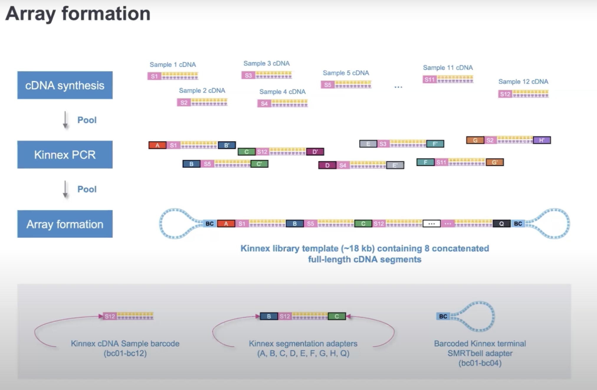

A. Kinnex Full Length (bulk) - Overview
========================================

.. image:: ../_images/kinnex_bulk_pb.png
   :scale: 45%
   :alt: Novel Methods and R&D
   :align: right

The PacBio Kinnex™ full-length RNA kit takes total RNA as input and 
outputs a sequencing-ready library that results in an 8-fold throughput increase 
compared to typical IsoSeq libraries. 

Complete application note published by Pacbio for Kinnex Full Length can be found here : 
`Application Note <https://www.pacb.com/wp-content/uploads/Application-note-Kinnex-full-length-RNA-kit-for-isoform-sequencing.pdf>`_

Quick Notes:

• Input 300 ng total RNA, RIN ≥7
• Generate up to 12-plex barcoded cDNA using (Iso-Seq express 2.0 kit)
• 2-day Kinnex library preparation using Kinnex full-length RNA kit 
• Barcoded Kinnex adapters support up to 4-plex multiplexing
• Total 48 samples per flowcell
• ~40 million cDNA sequences

Here is a schematic representation of the multi-plexing scheme:

Overall Workflow in a nutshell
--------------------------------

.. figure:: ../_images/kinnex_bulk.png
   :alt: Novel Methods and R&D
   :align: left
