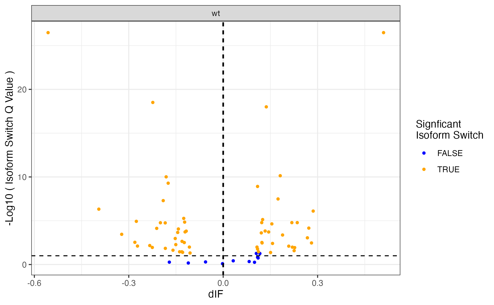
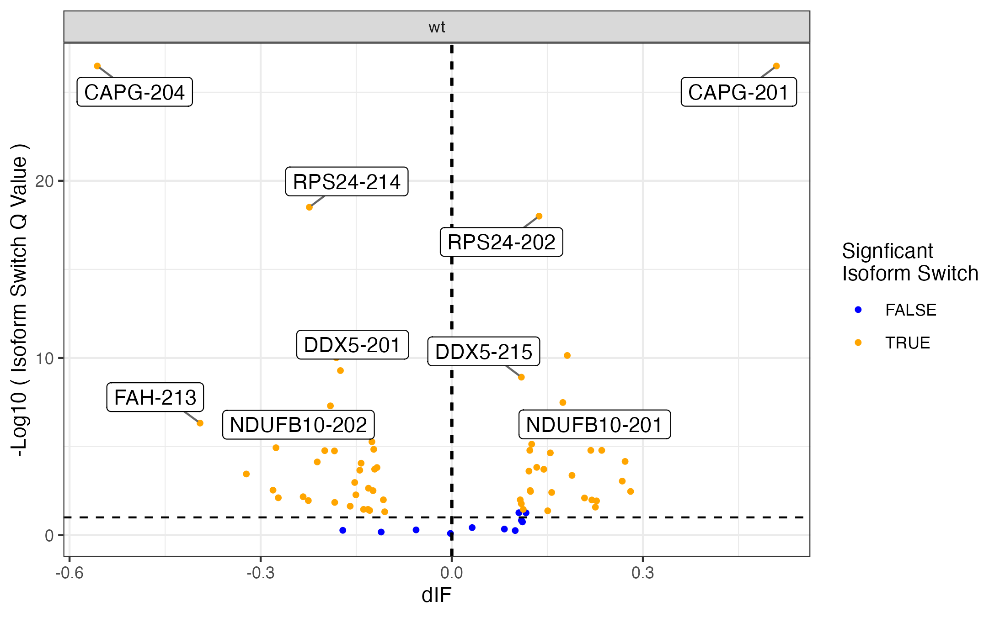
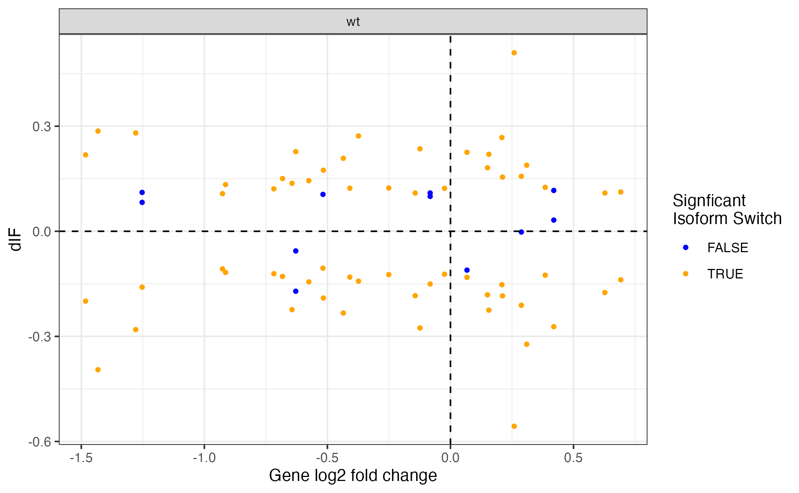

Vignette for analyzing and plotting isoform Switching for Kinnex Full Length
============================================================================

The `isoformSwitchAnalyzeR <https://www.bioconductor.org/packages/release/bioc/html/IsoformSwitchAnalyzeR.html>`_ is an R package developed to enable statistical identification of isoform switching and alternative isoform usage.
This vignette is based on the `isoformAnlayzeR tutorial provided <https://bioconductor.statistik.tu-dortmund.de/packages/3.8/bioc/vignettes/IsoformSwitchAnalyzeR/inst/doc/IsoformSwitchAnalyzeR.html>`_

We would analyze the bulk samples with this vignette here.

Module to install packages
~~~~~~~~~~~~~~~~~~~~~~~~~~~

Setting the environment:

.. code:: bash 

     #{r}
    install_if_missing <- function(packages) {
    if (length(setdiff(packages, rownames(installed.packages()))) > 0) {
        install.packages(setdiff(packages, rownames(installed.packages())))
    }
}

Install tidyverse, IsoformSwitchAnalyzeR and edgeR

.. code:: bash 

   #{r}
   install_if_missing(c('tidyverse','stringr','dplyr','edgeR','ggrepel'))
   if (!require("BiocManager", quietly = TRUE))
    install.packages("BiocManager")
    BiocManager::install(c("IsoformSwitchAnalyzeR","edgeR", "limma", "DESeq2", "ctc", "Biobase", "gplots", "ape", "argparse","dplyr"))

Importing libraraies:

.. code:: bash
    
    #{r}
    set.seed(2023)
    library(tidyverse)
    library(IsoformSwitchAnalyzeR)
    library(edgeR)
    library(dplyr)
    packageVersion('IsoformSwitchAnalyzeR')
    options(warn=-1)

Set working dir:

.. code:: bash 

   #{r}
   pdir='../Kinnex_bulk/'
   setwd(pdir)
   counts = read_tsv(file.path(pdir, "isoquant_counts_combined_wRefids.tsv")) %>% as.data.frame()

exploring counts matrix:
.. code:: bash 

   #{r}
   colnames(counts)
   length(counts$isoform_id)
   length(unique(counts$isoform_id))
   head(counts$isoform_id,3)

Reading in gtf
~~~~~~~~~~~~~~~
.. code:: bash 

   #{r}
   gtf = read_tsv(file.path(pdir,'stringtie_merged.wRefIds.gtf'), skip = 5, col_names = F) %>% filter(X3 == 'transcript')
   ##"; transcript_id " "MSTRG.5.2^ENSG00000228794.11^ENST00000445118.7^j"
   head(str_split_fixed(gtf$X9, '\\"',5) [,4],5)
   transcript_in_db = str_split_fixed(gtf$X9, '\\"',5) [,4] 
   counts$isoform_id[!(counts$isoform_id %in% transcript_in_db)]
   counts2 = as_tibble(transcript_in_db) %>% left_join(as_tibble(counts), c('value' = 'isoform_id')) 
   counts2[is.na(counts2)] = 0
   colnames(counts2) = c('isoform_id', colnames(counts2)[2:length(colnames(counts2))])
   counts = as.data.frame(counts2)

Computes counts per million (CPM) or reads per kilobase per million (RPKM) values

.. code:: bash 

   #{r}
   cpm <- cpm(counts[,-1], log=FALSE)
   abundance = as.tibble(cbind(isoform_id = counts[,1],as.tibble(cpm)))
   colnames(abundance)[-1][-1]

Creating Design object
~~~~~~~~~~~~~~~~~~~~~~~
.. code:: bash 

   #{r}
   myDesign <- data.frame(
    sampleID = colnames(abundance)[-1][-1],
    condition = c('wt','wt','wt','mut','mut','mut')
    )
    myDesign

importRdata function 
~~~~~~~~~~~~~~~~~~~~~

Creates SwitchAnalyzeRlist From Standard R Objects
isoformNtFasta obtained by running Gffread on the merged assembly as below:
gffread stringtie_merged.wRefIds.gtf -g refs/GRCh38_no_alt.fa -w bulk_kinnex_stringtie_merged.wRefIds.fasta

.. code:: bash 

   #{r}
   aSwitchList <- importRdata(
    isoformCountMatrix   = counts,
    isoformRepExpression = abundance,
    designMatrix         = myDesign,
    isoformExonAnnoation = file.path(pdir, "stringtie_merged.wRefIds.gtf"),
    isoformNtFasta       = file.path(pdir,"bulk_kinnex_stringtie_merged.wRefIds.fasta"),
    showProgress = FALSE
    )

Terminal Output:

Step 1 of 10: Checking data...
Step 2 of 10: Obtaining annotation...
importing GTF (this may take a while)...
Warning:    No CDS annotation was found in the GTF files meaning ORFs could not be annotated.
(But ORFs can still be predicted with the analyzeORF() function)Warning: The annotation and quantification (count/abundance matrix and isoform annotation) Seem to be slightly different. 
Specifically:
1 isoforms were only found in the annotation
 
Please make sure this is on purpouse since differences will cause inaccurate quantification and thereby skew all analysis.
 If you have quantified with Salmon this could be normal since it as default only keep one copy of identical sequnces (can be prevented using the --keepDuplicates option)
 We strongly encurage you to go back and figure out why this is the case.

3 ( 0.01%) isoforms were removed since they were not expressed in any samples.
Step 3 of 10: Fixing StringTie gene annoation problems...
There were no need to rescue any annotation
Step 4 of 10: Calculating expression estimates from count data...
Skipped as user supplied expression via the "isoformRepExpression" argument...
Step 5 of 10: Testing for unwanted effects...
Added 1 batch/covariates to the design matrix
Step 6 of 10: Batch correcting expression estimates...
Step 7 of 10: Extracting data from each condition...
Step 8 of 10: Making comparisons...
Step 9 of 10: Making switchAnalyzeRlist object...
Step 10 of 10: Guestimating differential usage...

##
comparison        estimated_genes_with_dtu
<chr>             <chr>
mut vs wt	        42 - 70

Pre-filtering switchObject on threholds
~~~~~~~~~~~~~~~~~~~~~~~~~~~~~~~~~~~~~~~

#default values:
#dIF differential Isoform Usage cutoff (IF isoform fraction) required to consider an isoform switching = 0.1 10%
#https://rdrr.io/bioc/IsoformSwitchAnalyzeR/man/preFilter.html

.. code:: bash 

   #{r}
   aSwitchList <- preFilter(
    switchAnalyzeRlist = aSwitchList,
    IFcutoff=0.01,
    acceptedGeneBiotype = NULL,
    acceptedIsoformClassCode = NULL,
    removeSingleIsoformGenes = TRUE,
    reduceToSwitchingGenes=FALSE,
    reduceFurtherToGenesWithConsequencePotential = FALSE,
    onlySigIsoforms = FALSE,
    keepIsoformInAllConditions=FALSE,
    alpha=0.05,
    dIFcutoff = 0.1,
    quiet=FALSE
    )

Terminal Out:
filtering removed 24317 ( 94.07% of ) transcripts. There is now 1534 isoforms left.

Analyze ORFs
~~~~~~~~~~~~

.. code:: bash 

   #{r}
   ### 2.2
    aSwitchList = analyzeORF(
    aSwitchList,
    genomeObject = NULL,
    minORFlength=100,
    orfMethod = "longest",
    cds = NULL,
    PTCDistance = 25,
    startCodons="ATG",
    stopCodons=c("TAA", "TAG", "TGA"),
    showProgress=TRUE,
    quiet=FALSE
    )

Terminal Out:
Step 1 of 3 : Extracting transcript sequences...
Step 2 of 3 : Locating potential ORFs...
100%
Step 3 of 3 : Scanning for PTCs...
1532 putative ORFs were identified, analyzed and added.
Done

.. code:: bash 

   #{r}
   group <- factor(aSwitchList$designMatrix$condition)
    y <- DGEList(counts=aSwitchList$isoformCountMatrix,group=group)
    y <- normLibSizes(y)
    design <- model.matrix(~group)
    y <- estimateDisp(y, design)
    y <- estimateTagwiseDisp(y)
    et <- exactTest(y, pair = c('wt','mut'))
    res1 = mutate(topTags(et, n = nrow(et$table))$table, condition_1 = 'wt', condition_2 = 'mut')
    res = rbind(res1)
    res = mutate(res, condition_join = paste(res$condition_1, res$condition_2, res$isoform_id, sep = '_'))

Isoform analyze Part1:
~~~~~~~~~~~~~~~~~~~~~~

https://bioconductor.org/packages/devel/bioc/manuals/IsoformSwitchAnalyzeR/man/IsoformSwitchAnalyzeR.pdf

.. code:: bash 

   #{r} 
   ### 2.3
    aSwitchList_part1 <- isoformSwitchAnalysisPart1(
        switchAnalyzeRlist   = aSwitchList,
        pathToGTF =  file.path(pdir, "stringtie_merged.wRefIds.gtf") ,
        pathToOutput = file.path(pdir, "isoformSwitchAnalysisR/Output/isoformSwitchAnalysisPart1_results"),
        outputSequences      = TRUE, # change to TRUE whan analyzing your own data 
        prepareForWebServers = TRUE,  # change to TRUE if you will use webservers for external sequence analysis
    )
    summary(aSwitchList_part1)
    #saveRDS(aSwitchList_part1, 'aSwitchList.rds')

Terminal Out:

Step 1 of 3 : Detecting isoform switches...
Step 3 of 3 : Extracting (and outputting) sequences
The 'removeLongAAseq' and 'removeShortAAseq' arguments:
Removed : 0 isoforms.
Trimmed : 1 isoforms (to only contain the first 1000 AA)
The 'alsoSplitFastaFile' caused 1 fasta files, each with a subset of the data, to be created (each named X of Y).

The number of isoform switches found were:
The nucleotide and amino acid sequences of these isoforms have been outputted to the supplied directory. 
These sequences enabling external analysis of protein domians (Pfam), coding potential (CPAT/CPC2) or signal peptides (SignalIP). 
See ?analyzeCPAT, ?analyzeCPC2, ?analyzePFAM or?analyzeSignalIP (under details) for suggested ways of running these three tools.

.. code:: bash 

   #{r} 
   summary(aSwitchList_part1)

Terminal Out:

This switchAnalyzeRlist list contains:
72 isoforms from 33 genes
1 comparison from 2 conditions (in total 6 samples)

Switching features:

Feature analyzed:
[1] "Isoform Switch Identification, ntSequence, ORFs, aaSequence"

Restart point:
.. code:: bash 

   #{r} 
   #aSwitchList_part1 = readRDS('aSwitchList.rds')

.. code:: bash 

   #{r} 
   summary(aSwitchList_part1$isoformCountMatrix)
    dim(aSwitchList_part1$isoformCountMatrix)
    aSwitchList_part1$isoformCountMatrix

    aSwitchList <- aSwitchList_part1
    group <- factor(aSwitchList$designMatrix$condition)
    group

DGEList function 
~~~~~~~~~~~~~~~~

Creates a DGEList object from a table of counts (rows=features, columns=samples), group indicator for each column, library size (optional) and a table of feature annotation (optional).

normLibSizes - The normLibSizes function normalizes the library sizes in such a way to minimize the log-fold
changes between the samples for most genes. The default method for computing these scale
factors uses a trimmed mean of M-values (TMM) between each pair of samples.

.. code:: bash 

   #{r} 
   y <- DGEList(counts=aSwitchList$isoformCountMatrix,group=group)
   y <- normLibSizes(y)

   ~group
    design <- model.matrix(~group)
    design

estimateDisp: from edgeR package
Maximizes the negative binomial likelihood to give the estimate of the common, trended and tagwise dispersions across all tags.

.. code:: bash 

   #{r} 
   estimateDisp(y, design)
   y <- estimateDisp(y, design)

estimateTagwiseDisp from edgeR:
Estimates tagwise dispersion values by an empirical Bayes method based on weighted conditional maximum likelihood

.. code:: bash 

   #{r} 
   estimateTagwiseDisp(y)
   y <- estimateTagwiseDisp(y)

exactTest for edgeR:
Compute genewise exact tests for differences in the means between two groups of negative-binomially distributed counts.

.. code:: bash 

   #{r} 
   et <- exactTest(y, pair = c('wt','mut'))
   et

   res1 = mutate(topTags(et, n = nrow(et$table))$table, condition_1 = 'mut', condition_2 = 'wt')
   res = rbind(res1)
   res = mutate(res, condition_join = paste(res$condition_1, res$condition_2, res$isoform_id, sep = '_'))
   res

Mutating isoformSwitchObject
~~~~~~~~~~~~~~~~~~~~~~~~~~~~
.. code:: bash 

   #{r}  
   aSwitchList_condition_join = paste(aSwitchList$isoformFeatures$condition_1, aSwitchList$isoformFeatures$condition_2, aSwitchList$isoformFeatures$isoform_id, sep = '_')
   aSwitchList$isoformFeatures$iso_p_value = res$PValue[match(aSwitchList_condition_join, res$condition_join)]
   aSwitchList$isoformFeatures$iso_q_value = res$FDR[match(aSwitchList_condition_join, res$condition_join)]
   aSwitchList$isoformFeatures$iso_significant = res$FDR[match(aSwitchList_condition_join, res$condition_join)] < 0.05
   aSwitchList$isoformFeatures$iso_significant[aSwitchList$isoformFeatures$iso_significant == TRUE] = 'yes'
   aSwitchList$isoformFeatures$iso_significant[aSwitchList$isoformFeatures$iso_significant == FALSE] = 'no'

.. code:: bash 

   #{r}  
   summary(aSwitchList$isoformFeatures$isoform_switch_q_value)
   summary(res$FDR[match(aSwitchList_condition_join, res$condition_join)] < 0.05)
   res$FDR[match(aSwitchList_condition_join, res$condition_join)] < 0.05

   head(str_split_fixed(aSwitchList$isoformFeatures$isoform_id, '\\^',4))

Getting gene names and gene symbols:
.. code:: bash 

    #{r}  
    library('biomaRt')
    library('devtools')
    if(!require('annotables')) {
    install.packages('annotables')
    library('annotables')
    }
    BiocManager::install("org.Hs.eg.db")

    #Getting GRCh38 reference:
    if (!require("BiocManager", quietly = TRUE))
    install.packages("BiocManager")

    BiocManager::install("BSgenome.Hsapiens.NCBI.GRCh38")

    #EnsDb.Hsapiens.v86 reference database:
    if (!require("BiocManager", quietly = TRUE))
    install.packages("BiocManager")

    BiocManager::install("EnsDb.Hsapiens.v86")

This function returns a list of BioMart databases hosted by Ensembl. To establish a connection use the useMart function.   

.. code:: bash 

   #{r}  
   listEnsembl()
   ensmbl <- useEnsembl(biomart = "genes")
   ensml_datasets <- listDatasets(ensmbl)

useMart func: Connects to the selected BioMart database and dataset

.. code:: bash 

   #{r}  
   mart = useMart("ensembl")
   mart = useMart(biomart="ensembl", dataset="hsapiens_gene_ensembl")

.. code:: bash 

   #{r}  
   attr <- listAttributes(mart)
   filters <- listFilters(mart)

Ref Ensmbl Ids in dataset
~~~~~~~~~~~~~~~~~~~~~~~~~~

.. code:: bash 

   #{r} 
   isoformFeatures_wIds <- aSwitchList$isoformFeatures
   isoformFeatures_wIds$ref_transcript_id <- str_split_fixed(isoformFeatures_wIds$isoform_id, '\\^',4)[,3]
   isoformFeatures_wIds$ref_gene_id <- str_split_fixed(isoformFeatures_wIds$isoform_id, '\\^',4)[,2]

.. code:: bash 

   #{r}  
   refIds <- getBM(attributes = c('ensembl_gene_id_version','ensembl_transcript_id_version',
                     'external_gene_name','external_transcript_name'),
      filters = "ensembl_gene_id_version",
      values = isoformFeatures_wIds$ref_gene_id,
      mart = mart
)

.. code:: bash 

   #{r}  
   refIds <- refIds %>% unique()
   refIds
   colnames(refIds) = c('gene_id', 'transcript_id', 'gene_name', 'transcript_name')
   refIds

.. code:: bash 

   #{r}  
   isoformFeatures_wIds <- left_join(isoformFeatures_wIds %>% dplyr::select(-c("gene_name")),
                     refIds %>%
                     unique(),
           by=c("ref_transcript_id"="transcript_id", 
                "ref_gene_id"="gene_id"))

Volcano like plot
~~~~~~~~~~~~~~~~~~

.. code:: bash 

   #{r}  
   ### Volcano like plot:
    library(ggrepel)

    ggplot(data=isoformFeatures_wIds, aes(x=dIF, y=-log10(isoform_switch_q_value)), label=isoformFeatures_wIds$isoform_id) +
     geom_point(
        aes( color=abs(dIF) > 0.1 & isoform_switch_q_value < 0.05,), # default cutoff
        size=1
    ) + 
    geom_hline(yintercept = -log10(0.1), linetype='dashed') + # default cutoff
    geom_vline(xintercept = c(-0.001, 0.001), linetype='dashed') + # default cutoff
    facet_wrap( ~ condition_2) +
    #facet_grid(condition_1 ~ condition_2) + # alternative to facet_wrap if you have overlapping conditions
    scale_color_manual('Signficant\nIsoform Switch', values = c('blue','orange')) +
    labs(x='dIF', y='-Log10 ( Isoform Switch Q Value )') +
    theme_bw()

   
.. code:: bash 

   #{r} 
   library(ggrepel)

    nbaplot = ggplot(data=isoformFeatures_wIds, aes(x=dIF, y=-log10(isoform_switch_q_value)), label=isoformFeatures_wIds$isoform_id) +
     geom_point(
        aes( color=abs(dIF) > 0.01 & isoform_switch_q_value < 0.05,), # default cutoff
        size=1
    ) + 
    geom_hline(yintercept = -log10(0.1), linetype='dashed') + # default cutoff
    geom_vline(xintercept = c(-0.001, 0.001), linetype='dashed') + # default cutoff
    facet_wrap( ~ condition_2) +
    #facet_grid(condition_1 ~ condition_2) + # alternative to facet_wrap if you have overlapping conditions
    scale_color_manual('Signficant\nIsoform Switch', values = c('blue','orange')) +
    labs(x='dIF', y='-Log10 ( Isoform Switch Q Value )') +
    theme_bw()
    
    nbaplot + 
    geom_label_repel(aes(label=ifelse(-log10(isoform_switch_q_value)>0.1,as.character(isoformFeatures_wIds$transcript_name),'')),
                  box.padding   = 0.35, 
                  point.padding = 0.1,
                  segment.color = 'grey40')

Switch vs Gene changes
~~~~~~~~~~~~~~~~~~~~~~

.. code:: bash 

   #{r} 
   ggplot(data=isoformFeatures_wIds, aes(x=gene_log2_fold_change, y=dIF)) +
    geom_point(
        aes( color=abs(dIF) > 0.1 & isoform_switch_q_value < 0.05 ), # default cutoff
        size=1
    ) + 
    facet_wrap(~ condition_2) +
    #facet_grid(condition_1 ~ condition_2) + # alternative to facet_wrap if you have overlapping conditions
    geom_hline(yintercept = 0, linetype='dashed') +
    geom_vline(xintercept = 0, linetype='dashed') +
    scale_color_manual('Signficant\nIsoform Switch', values = c('blue','orange')) +
    labs(x='Gene log2 fold change', y='dIF') +
    theme_bw()

Restart point:

.. code:: bash 

   #{r} 
   #saveRDS(aSwitchList_part1, 'aSwitchList.rds')
   #aSwitchList_part1 = readRDS('aSwitchList.rds')

isoformSwitchAnalysisPart2 : 
~~~~~~~~~~~~~~~~~~~~~~~~~~~~

adds the results of the external sequence analysis supplied and then analyzes alternative splicing.

Pfam annotations are required, in addition we can provide annotations generated with the tools below.
CPC2 Coding Potential Calculator : https://cpc2.gao-lab.org/

Pfam - domain annotation `pfam_scan.pl -as -dir isoformSwitchAnalysisPart1_results -fasta isoformSwitchAnalyzeR_isoform_AA_complete.fasta -cpu 4 -e_seq 10.0 -e_dom 10.0 > Pfam_result.txt`

IUPred Intrinsically disordered proteins (IDPs) : https://iupred2a.elte.hu/

SignalP Signal peptide and cleavage sites in gram+, gram- and eukaryotic amino acid sequences (signal pipetide at N terminus) : https://services.healthtech.dtu.dk/services/SignalP-5.0/

.. code:: bash 

   #{r}  
   aSwitchList <- analyzePFAM(
    aSwitchList,
    pathToPFAMresultFile = file.path(pdir, "isoformSwitchAnalysisR/Output/Pfam_out.txt"),
    showProgress=TRUE,
    quiet=FALSE
    
    )

.. code:: bash 

   #{r} 
    aSwitchList <- isoformSwitchAnalysisPart2(
   switchAnalyzeRlist        = aSwitchList,
   n                         = 10,    # if plotting was enabled, it would only output the top 10 switches
   removeNoncodinORFs        = TRUE,
   pathToCPC2resultFile      = file.path(pdir, "isoformSwitchAnalysisR/Output/cpc2output.txt"),
   pathToIUPred2AresultFile  = file.path(pdir, "isoformSwitchAnalysisR/Output/iupred2a_out.txt"), 
   pathToSignalPresultFile   = file.path(pdir, "isoformSwitchAnalysisR/Output/prediction_results.txt"), 
   pathToDeepTMHMMresultFile = file.path(pdir, "isoformSwitchAnalysisR/Output/TMRs.gff3"),
   outputPlots               = TRUE
    )

