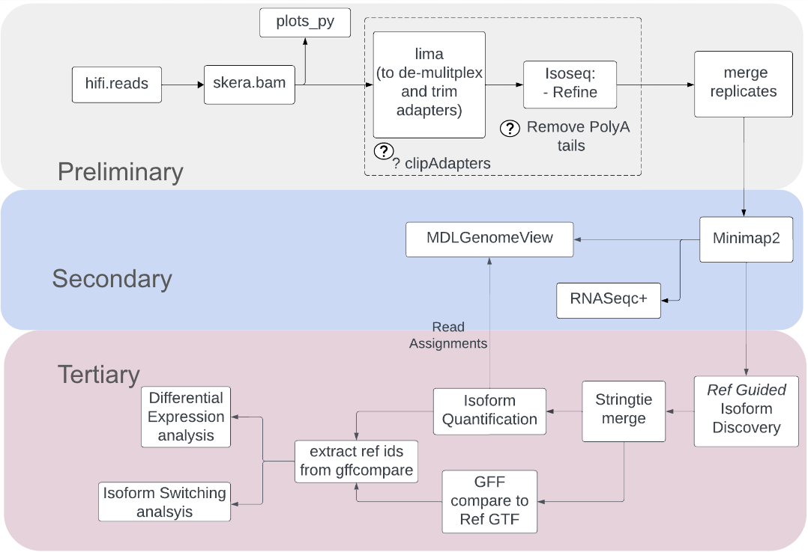

Pre-processing workflows:
=========================

a. Kinnex Full Length 
----------------------
Overall Workflow:
   
   - Performing Sample QC and PCA with Ptr utility from Trinity toolkit.
   - Minimap2 for aligning reads
   - Isoquant for Reference guided Isoform Discovery.
   - Stringtie merge to merge reconstructed assemblies to generate new Ref
   - Quantification with Isoquant against reconstructed ref
   - Gffcompare to compare against reference and fetch Ref Ids
   - Differential Expression analysis using DEseq2 implementation from the Trinity
   - Exploring isoform switches and isoform visualization with isoformSwitchAnalysisR
   - MDLgenomeview for inspecting read support

Insert Workflow image here

b. Kinnex Single Cell
----------------------