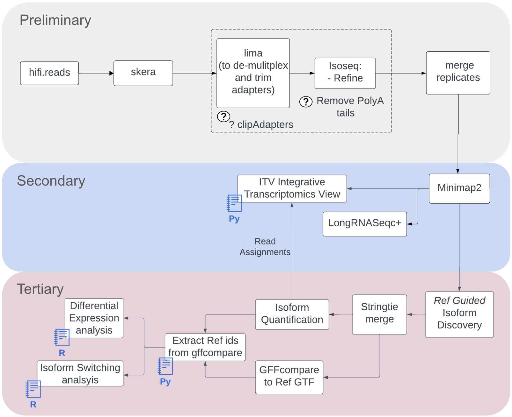

1. Kinnex Full Length (bulk) sequencing
========================================

.. image:: ../_images/kinnex_bulk_pb.png
   :scale: 45%
   :alt: Novel Methods and R&D
   :align: right

The PacBio Kinnex™ full-length RNA kit takes total RNA as input and 
outputs a sequencing-ready library that results in an 8-fold throughput increase 
compared to typical IsoSeq libraries. 

Complete application note published by Pacbio for Kinnex Full Length can be found here : 
`Application Note <https://www.pacb.com/wp-content/uploads/Application-note-Kinnex-full-length-RNA-kit-for-isoform-sequencing.pdf>`_

Quick Notes:

• Input 300 ng total RNA, RIN ≥7
• Generate up to 12-plex barcoded cDNA using (Iso-Seq express 2.0 kit)
• 2-day Kinnex library preparation using Kinnex full-length RNA kit 
• Barcoded Kinnex adapters support up to 4-plex multiplexing
• Total 48 samples per flowcell
• ~40 million cDNA sequences

Here is a schematic representation of the multi-plexing scheme:

.. figure:: ../_images/bulk_multiplexing_scheme.png
   :scale: 45%
   :align: right

Overall Workflow in a nutshell
--------------------------------

Preliminary analysis
---------------------
The pre-processing workflows extract clean s-reads using 3 tools as below which can then be provided to the alignment applications and other downstream workflows similar to those used to analyze Isoseq data.

   - `skera <https://skera.how/>`_ for de-concatenating the MAS arrays into individual cDNA molecules and generate segmented reads (s-reads),
   - `lima <https://lima.how/>`_ to de-multiplex a bulk pool and remove unwanted combinations while orienting sequences in 5’ → 3’ orientation and 
   - `isoseq refine <https://isoseq.how/getting-started.html>`_ for trimming poly(A) tails and extracting Full length non-concatemer reads (FLNC) from s-reads.
   - `samtools merge <https://www.htslib.org/doc/samtools-merge.html>`_ - only applicable in case technical replicates are generated to boost yeild by sequencing over mulitple flowcells, in which case the reads for each biological sample would require to me merged together.

1.1. `pbskera`
~~~~~~~~~~~~~~~~
The pbskera workflow, as detailed below, processes raw HiFi reads generated with Sequel2e and Revio Long Read sequencers. The HiFi reads are a current default, and can be plugged in directly into the workflow to get segmented s-reads. 

Workflow configuration for runnning these over cloud platforms supporting Cromwell like Terra can be found here:-

      | Dockstore : `skera_w_QCplots.wdl <https://dockstore.org/my-workflows/github.com/MethodsDev/masseq_data_processing/pbskera_main>`_
      | Github: `Kinnex Preliminary Processing <https://github.com/MethodsDev/masseq_data_processing>`_
      | Test Data can be found here (public, requester-pays) : `gs://mdl-preprocess-refs/test_data/m12345_123456_123456_s1.hifi_reads.bcM0003.bam` 

The direct command executed here is:

.. code:: bash
   :number-lines: 

       skera split –j 8 reads.hifi.bam mas_adapters.fasta reads.skera.bam

**Input arguments for pbskera_main**

.. csv-table:: `bulk - skera`
   :file: ../_subpages/tables/skera_bulk.csv
   :header-rows: 1

Running the workflow above also generates plots to sanity check the s-reads generated by deconacatenation. 
There are 3 plots as of now:  

.. list-table:: 
    :widths: 35 32 33

    * - .. figure:: ../_images/m12345_123456_123456_s1.bcM0003.readlen_hist.png
           :alt: m84014_240128_083549_s3_sub0005.bcM0003.readlen_hist
           :width: 95%

           Read Length Histogram

      - .. figure:: ../_images/m12345_123456_123456_s1.bcM0003.ligations_heatmap.png
           :alt: m84014_240128_083549_s3_sub0005.bcM0003.ligations_heatmap

           Ligation Heatmap

      - .. figure:: ../_images/m12345_123456_123456_s1.bcM0003.concat_hist.png
           :alt: m84014_240128_083549_s3_sub0005.bcM0003.ligations_heatmap

           Concatenation Histogram

For a bulk 8-mer we expect the plots to be similar to as above, with maximum number of reads assigned to a complete 8-mer configuration.
In addition, to the readlength plot, the concatenation histogram should also indicate high percentages (>90%) to be assigned to a concatenation factor of 8.
The ligation heatmap distributes the number of reads by adapter pairs found in the array. They should cleanly align along the diagonal for a well-performing array.

1.2. `lima demux + isoseq refine`
~~~~~~~~~~~~~~~~~~~~~~~~~~~~~~~~~~~
This workflow uses 2 tools to extract clean s-reads from the skera.bam received above. 

Workflow configuration for runnning these over cloud platforms supporting Cromwell like Terra can be found here:-
   
      | Dockstore : `bulk_demux.wdl <https://dockstore.org/workflows/github.com/MethodsDev/masseq_data_processing/bulk_demux>`_
      | Github : `Kinnex Preliminary Processing <https://github.com/MethodsDev/masseq_data_processing>`_
      | Test Data: `gs://mdl-preprocess-refs/test_data/m12345_123456_123456_s1.hifi_reads.bcM0003.bam` (public, requester-pays)

The direct command executed here is:

.. code:: bash
   :number-lines: 

       lima --isoseq --log-level INFO -j 8 reads.skera.bam bulk_barcodes.fasta sample_id.lima.bam

       isoseq refine --require-polya -j 8 sample_id.lima.bam bulk_barcodes.fasta sample_id.refine.bam 

**Input arguments for pbskera_main**

.. csv-table:: `bulk lima+refine`
   :file: ../_subpages/tables/lima_refine_bulk.csv
   :header-rows: 1

1.3. `merge`
~~~~~~~~~~~~~~
The merge_refine_bams workflow, as detailed below, merges refined clean s-reads generated with workflows above for various technical replicates. It is an optional workflow and can be replaced by merging replicates by hand which is recommended if custom edits are to be made before merging like adding custom tags to the bam for each replicate.

Workflow configuration for runnning these over cloud platforms supporting Cromwell like Terra can be found here:-

      | Dockstore : `merge_refine_bams.wdl <https://dockstore.org/workflows/github.com/MethodsDev/masseq_data_processing/merge_main>`_
      | Github: `Kinnex Preliminary Processing <https://github.com/MethodsDev/masseq_data_processing/blob/main/wdl/merge_refine_bams.wdl>`_
      | Test Data can be found here (public, requester-pays) : `gs://mdl-preprocess-refs/test_data/m12345_123456_123456_s1.hifi_reads.bcM0003.bam` 

It requires an inputfile.csv with the sample to barcode combination used for multiplexing the samples. An example file corresponding to the test data is provided below.`Sample_ID`,`Kinnex_Adapter`,`IsoSeq_primer` are required (case-insensitive) columns. The file can have additional optional columns with snake_cased colnames.

.. csv-table:: bulk - idmap.csv , sample to barcode matching
   :file: ../test_data/idmap_bcM0001.csv
   :header-rows: 1

The workflow calls the script below which leverages pysam utils to merge reads and rename by the sample_ids provided in the idmap.csv file above the here is:

.. code:: python
   :number-lines: 

      python /usr/local/src/masseq_data_processing/pb_plots/mergeBams.py \
            -idmap ~{barcode_to_sample} \
            -bampath . \
            -limacountsdir . \
            -outdir . \
            -mergeReplicates \
            -setTitleSamplePlot ~{datasetId} 

**Input arguments for pbskera_main**

.. csv-table:: bulk - merge
   :file: ../_subpages/tables/merge_bulk.csv
   :header-rows: 1

Upon merging the replicates, the reads are ready to be analysed with the Secondary Processing workflows.