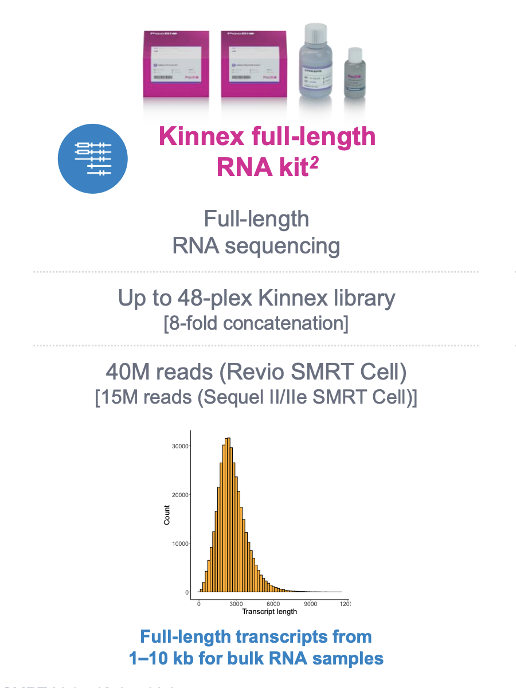

Analysis workflows
++++++++++++++++++
The analysis workflows for Kinnex products are similar for pre-processing with a few tweaks in parameters, and diverge there after. 
The preliminary processing mainly leverages various applications from PacBio Analysis Toolkit. 
Most workflows have WDL wrappers publicly accessible via Dockstore with test data and reference files to follow along placed in public requester-pays Google Storage bucket.

Kinnex Full Length 
=====================

The PacBio Kinnex™ full-length RNA kit takes total RNA as input and 
outputs a sequencing-ready library that results in an 8-fold throughput increase 
compared to typical IsoSeq libraries. 

Complete application note published by PAcbio for Kinnex Full Length can be found here : 
`Application Note <https://www.pacb.com/wp-content/uploads/Application-note-Kinnex-full-length-RNA-kit-for-isoform-sequencing.pdf>`_

Quick Notes:

• Input 300 ng total RNA, RIN ≥7
• Generate up to 12-plex barcoded cDNA using (Iso-Seq express 2.0 kit)
• 2-day Kinnex library preparation using Kinnex full-length RNA kit 
• Barcoded Kinnex adapters support up to 4-plex multiplexing
• Total 48 samples per flowcell
• ~40 million cDNA sequences
  

Overall Workflow in a nutshell
------------------------------

.. figure:: ../_images/bulk_workflow.png
   :alt: Novel Methods and R&D
   :align: left

Preliminary analysis
--------------------
The pre-processing workflows extract clean s-reads using 3 tools as below which can then be provided to the alignment applications and other downstream workflows similar to those used to analyze Isoseq data.

   - `skera <https://skera.how/>`_ for de-concatenating the MAS arrays into individual cDNA molecules and generate segmented reads (s-reads),
   - `lima <https://lima.how/>`_ to de-multiplex a bulk pool and remove unwanted combinations while orienting sequences in 5’ → 3’ orientation and 
   - `isoseq refine <https://isoseq.how/getting-started.html>`_ for trimming poly(A) tails and extracting Full length non-concatemer reads (FLNC) from s-reads.

`pbskera`
~~~~~~~~~
The pbskera workflow, as detailed below, processes raw HiFi reads generated with Sequel2e and Revio Long Read sequencers. The HiFi reads are a current default, and can be plugged in directly into the workflow to get segmented s-reads. 

Workflow configuration for runnning these over cloud platforms supporting Cromwell like Terra can be found here:-

      | Dockstore : `skera_w_QCplots.wdl <https://dockstore.org/my-workflows/github.com/MethodsDev/masseq_data_processing/pbskera_main>`_
      | Github: `Kinnex Preliminary Processing <https://github.com/MethodsDev/masseq_data_processing>`_
      | Test Data can be found here (public, requester-pays) : `gs://mdl-preprocess-refs/test_data/m12345_123456_123456_s1.hifi_reads.bcM0003.bam` 

The direct command executed here is:

.. code:: bash
   :number-lines: 

       skera split –j 8 reads.hifi.bam mas_adapters.fasta reads.skera.bam

**Input arguments for pbskera_main**

.. csv-table:: skera
   :file: ../_subpages/tables/skera_bulk.csv
   :header-rows: 1

`lima demux + isoseq refine`
~~~~~~~~~~~~~~~~~~~~~~~~~~~~
This workflow uses 2 tools to extract clean s-reads from the skera.bam received above. 

Workflow configuration for runnning these over cloud platforms supporting Cromwell like Terra can be found here:-
   
      | Dockstore : `bulk_demux.wdl <https://dockstore.org/workflows/github.com/MethodsDev/masseq_data_processing/bulk_demux>`_
      | Github : `Kinnex Preliminary Processing <https://github.com/MethodsDev/masseq_data_processing>`_
      | Test Data: `gs://mdl-preprocess-refs/test_data/m12345_123456_123456_s1.hifi_reads.bcM0003.bam` (public, requester-pays)

The direct command executed here is:

.. code:: bash
   :number-lines: 

       lima --isoseq --log-level INFO -j 8 reads.skera.bam bulk_barcodes.fasta sample_id.lima.bam

       isoseq refine --require-polya -j 8 sample_id.lima.bam bulk_barcodes.fasta sample_id.refine.bam 

**Input arguments for pbskera_main**

.. csv-table:: lima
   :file: ../_subpages/tables/lima_refine_bulk.csv
   :header-rows: 1

