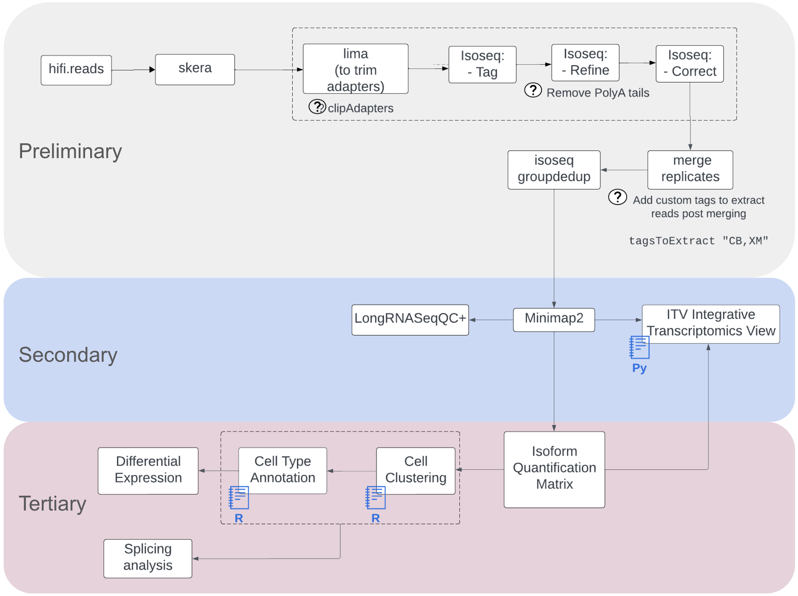

Kinnex Single Cell
===================

The PacBio Kinnex™ single-cell RNA kit takes as input single-cell cDNA and outputs a sequencing-ready library that
results in a 16-fold throughput increase compared to
regular single-cell Iso-Seq® libraries. More details on the sequencing platform can be found here: `PacBio's Single Cell FAQs <https://www.pacb.com/products-and-services/applications/rna-sequencing/single-cell-rna-sequencing/>`_

Complete application note published by Pacbio can be found here:
`Application note <https://www.pacb.com/wp-content/uploads/Application-note-Kinnex-single-cell-RNA-kit-for-single-cell-isoform-sequencing.pdf>`_

Quick notes:

• 10x Chromium Single Cell 3’ kit (v3.1) and 5’ kit (v2)
• 15–75 ng cDNA input
• 3,000 to 10,000 target cell recovery
• 2-day Kinnex library preparation using Kinnex single-cell RNA kit
• Barcoded Kinnex adapters support up to 4-plex multiplexing
• ~80MN reads

Kinnex Single Cell workflow overview:
-------------------------------------

Preliminary analysis
--------------------
The pre-processing workflows extract clean s-reads using tools below which can then be provided to the alignment applications and other downstream workflows similar to those used to analyze Isoseq data.
High level pre-processing is adopted from `Pacbio's CLI workflow <https://isoseq.how/umi/cli-workflow.html>`_

   - `skera <https://skera.how/>`_ for de-concatenating the MAS arrays into individual cDNA molecules and generate segmented reads (s-reads),
   - `lima <https://lima.how/>`_ for removal of primers and identification of barcodes and orienting sequences in 5’ → 3’ orientation.
   - `isoseq tag <https://isoseq.how/umi/umi-barcode-design.html#umibarcode-designs>`_  to clip tags (cell barcode, UMI, Gs). Supports design presets and custom experimental designs.
   - `isoseq refine <https://isoseq.how/getting-started.html>`_ for trimming poly(A) tails and extracting Full length non-concatemer reads (FLNC) from s-reads.
   - `isoseq correct <https://isoseq.how/umi/isoseq-correct.html>`_ for correcting errors in cell barcodes, the total number of usable reads increased (typically ~5%)

`pbskera`
~~~~~~~~~
The pbskera workflow, as detailed below, processes raw HiFi reads generated with Sequel2e and Revio Long Read sequencers. The HiFi reads are a current default, and can be plugged in directly into the workflow to get segmented s-reads. 

Workflow configuration for runnning these over cloud platforms supporting Cromwell like Terra can be found here:-

      | Dockstore : `skera_w_QCplots.wdl <https://dockstore.org/my-workflows/github.com/MethodsDev/masseq_data_processing/pbskera_main>`_
      | Github: `Kinnex Preliminary Processing <https://github.com/MethodsDev/masseq_data_processing>`_
      | Test Data can be found here (public, requester-pays) : `gs://fc-secure-6b69ce23-e507-4375-929c-75ab7213f277/kinnex_sc/m84014_240128_083549_s3_sub0005.hifi_reads.bcM0003.bam`

The direct command executed here is:

.. code:: bash
   :number-lines: 

       skera split –j 16 reads.hifi.bam mas16_adapters.fasta reads.skera.bam

**Input arguments for pbskera_main**

.. csv-table:: skera
   :file: ../_subpages/tables/skera_bulk.csv
   :header-rows: 1

Example of QC plots generated :

.. list-table:: 
    :widths: 35 32 33

    * - .. figure:: ../_images/m84014_240128_083549_s3_sub0005.bcM0003.readlen_hist.png
           :alt: m84014_240128_083549_s3_sub0005.bcM0003.readlen_hist

           Read Length Histogram

      - .. figure:: ../_images/m84014_240128_083549_s3_sub0005.bcM0003.ligations_heatmap.png
           :alt: m84014_240128_083549_s3_sub0005.bcM0003.ligations_heatmap

           Ligation Heatmap

      - .. figure:: ../_images/m84014_240128_083549_s3_sub0005.bcM0003.concat_hist.png
           :alt: m84014_240128_083549_s3_sub0005.bcM0003.ligations_heatmap

           Concatenation Histogram

For a 16-mer we expect the plots to be similar to as above, with maximum number of reads assigned to a complete 16-mer configuration.
In addition, to the readlength plot, the concatenation histogram should also indicate high percentages (>90%) to be assigned to a concatenation factor of 16.
The ligation heatmap distributes the number of reads by adapter pairs found in the array. They should cleanly align along the diagonal for a well-performing array.

`pblima  + isoseq tag + isoseq refine + isoseq correct`
~~~~~~~~~~~~~~~~~~~~~~~~~~~~~~~~~~~~~~~~~~~~~~~~~~~~~~~

This workflow uses 2 tools to extract clean s-reads from the skera.bam received above namely `lima <https://lima.how/get-started.html>`_ and `isoseq <https://isoseq.how/umi/>`_.  

Workflow configuration for runnning these over cloud platforms supporting Cromwell like Terra can be found here:-
   
      | Dockstore : `sc_kinnex_lima_plus_isoseq.wdl <https://dockstore.org/workflows/github.com/MethodsDev/masseq_data_processing/sc_kinnex_lima_plus_isoseq:main>`_
      | Github : `Kinnex Single Cell Preliminary Processing <https://github.com/MethodsDev/masseq_data_processing/blob/main/wdl/pb_sc_lima_plus_isoseq.wdl>`_
      | Test Data: `gs://fc-secure-6b69ce23-e507-4375-929c-75ab7213f277/kinnex_sc/m84014_240128_083549_s3_sub0005.bcM0003.skera.bam` (public, requester-pays)

**Example of input arguments for the workflow for 10x 3p kit**

.. code:: bash
  :number-lines: 

  {
   "pb_sc_lima_isoseq.sample_id": "${this.movie_name}",
   "pb_sc_lima_isoseq.barcodes_list": "gs://mdl-preprocess-refs/10x_barcodes/3M-february-2018-REVERSE-COMPLEMENTED.txt.gz",
   "pb_sc_lima_isoseq.primer_fasta": "gs://mdl-preprocess-refs/REF-10x_primers/10x_3kit_primers.fasta",
   "pb_sc_lima_isoseq.gcs_output_dir": "${this.out_path}",
   "pb_sc_lima_isoseq.skera_bam": "${this.skera_bam}",
   "pb_sc_lima_isoseq.read_design": "T-12U-16B"
}
