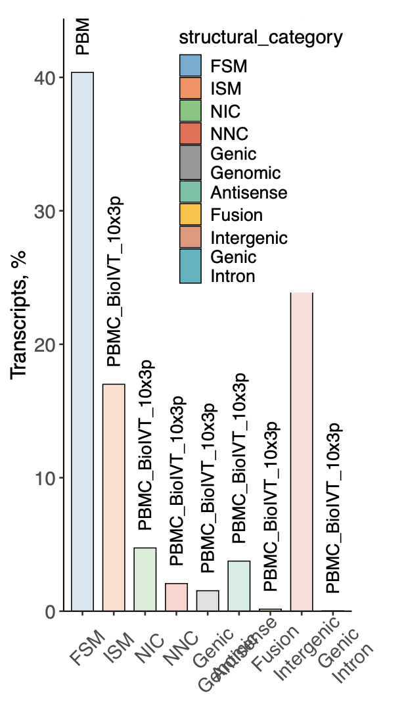

Read-level Quality Controls
+++++++++++++++++++++++++++

LongRNAqc+ is a workflow intended to look at base reads quality rather than collapsed reads, and to easily compare multiple samples on Terra. 
Taking an aligned BAM as input for a sample, it runs a long-read adapted version of RNAqc, Sqanti3, and optionally IsoQuant. 
Once multiple samples have been processed, a downstream workflow can be run on a selection of samples to generate a comparison report based on the Sqanti3 outputs.

Main workflow: `LongRNAqcPlusFromBAM`
~~~~~~~~~~~~~~~~~~~~~~~~~~~~~~~~~~~~~
Workflow configuration for runnning the main workflow over cloud platforms supporting Cromwell like Terra can be found here:-

      | Dockstore : `LongRNAqcPlusFromBAM.wdl <https://dockstore.org/workflows/github.com/broadinstitute/MDL-workflows/LongRNAqcPlusFromBAM:main>`_
      | Github: `LongRNAqcPlusFromBAM <https://github.com/broadinstitute/MDL-workflows/blob/main/LR-tools/LongRNAqc/LongRNAqcPlusFromBAM.wdl>`_
      | Test Data can be found here (public, requester-pays) : (add download link from github or gs here)

**Input arguments for LongRNAqcPlusFromBAM**

.. csv-table:: `LongRNAqcPlusFromBAM`
   :file: ../_subpages/tables/longRNAqcmain.csv
   :header-rows: 1

`LongRNAqc+ Plotting`
~~~~~~~~~~~~~~~~~~~~~
Workflow configuration for runnning LongRNAqc+ on Terra can be found here:-

      | Dockstore : `LongRNAqcPlotting:main <https://dockstore.org/workflows/github.com/broadinstitute/MDL-workflows/LongRNAqcPlotting:main>`_
      | Github: `LongRNAqcPlotting.wdl <https://github.com/broadinstitute/MDL-workflows/blob/main/LR-tools/LongRNAqc/LongRNAqcPlotting.wdl>`_
      | Test Data can be found here (public, requester-pays) : `add file path` 

**Example of input arguments for LongRNAqc+ workflow for alignment with human ref genome**

.. code:: bash
  :number-lines: 
  
  {
    "LongRNAqcPlotting.classificationFile":"${this.sqantiClassificationTSV}",
    "LongRNAqcPlotting.junctionFile":"${this.sqantiJunctionsTSV}",
    "LongRNAqcPlotting.includeSaturation":"${false}",
    "LongRNAqcPlotting.outputPrefix":"LongRNAqcPlots",
    "LongRNAqcPlotting.sampleName":"${this.samples.sample_id}"
    }

**Example of plots generated as a part of the output_report.pdf populated in `QC_plots` feild **

