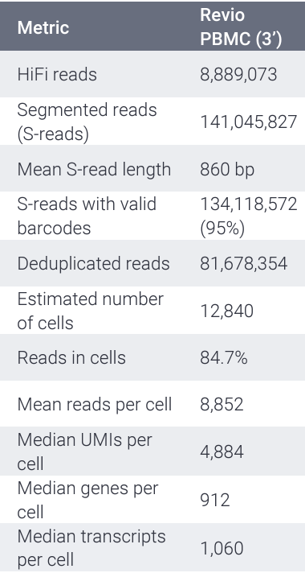

2. Single Cell Downstream Processing
=====================================
The cleaned s-reads obtained from the preliminary analysis can then be aligned to reference genome using  minimap2 `(publication link here) <https://academic.oup.com/bioinformatics/article/34/18/3094/4994778>`_.
As good practice the aligned reads should be QCed before proceeding further. The recommended tool to perform QC on long reads is Long LongRNAseqQC detailed in the Kinnex Full Length workflow.

   - `minimap2 <https://lh3.github.io/minimap2/minimap2.html>`_ for aligning reads
   - LongRNAqcPlus 
   - ITV Integrative Transcriptomics View for inspecting read support (link notebook here)

`isoseq master code: https://github.com/PacificBiosciences/IsoSeq/tree/master`

`Test Data` 
~~~~~~~~~~~
For the downstream processing of Kinnex single cell product, we are using the PacBio dataset `Revio-Kinnex-PBMC-10x3p <https://downloads.pacbcloud.com/public/dataset/Kinnex-single-cell-RNA/DATA-Revio-Kinnex-PBMC-10x3p/>`_ 
subsampled to get ~3M reads. 

More information on the dataset and other example datasets provided by PacBio for Single Cell can be found here `Kinnex-singe-cell-RNA <https://downloads.pacbcloud.com/public/dataset/Kinnex-single-cell-RNA/>`_

Here is the `ATCC guide on PBMCs <https://www.atcc.org/cell-products/primary-cells/immune-cells/peripheral-blood-mononuclear-cells#t=productTab&numberOfResults=24>`_ 

2.1. `minimap2`
~~~~~~~~~~~~~~~~~
The minimap2 workflow, as detailed below, maps long reads or their assemblies to a reference genome.
The details and parameters can be found in the `minimap2 manual <https://lh3.github.io/minimap2/minimap2.html>`_ 

Workflow configuration for runnning the minimap2 workflow over cloud platforms supporting Cromwell like Terra can be found here:-
The workflow is designed to be run on a sample. Technical replicates must be merged before.

      | Dockstore : `Minimap2_LR.wdl <https://dockstore.org/workflows/github.com/broadinstitute/MDL-workflows/Minimap2_LR:main>`_
      | Github: `minimap2_LR <https://github.com/broadinstitute/MDL-workflows/blob/main/LR-tools/minimap2_LR/minimap2_LR.wdl>`_
      | Test Data can be found here (public, requester-pays) : `add file path`

.. csv-table:: minimap2
   :file: ../_subpages/tables/minimap2.csv
   :widths: 20,25,55
   :header-rows: 1

**Example of input arguments for minimap2 workflow for alignment with human ref genome**

.. code:: bash
  :number-lines: 

   {
    "Minimap2_LR.Minimap2Task.cpu" : "${8}",
    "Minimap2_LR.Minimap2Task.diskSizeGB" : "${500}",
    "Minimap2_LR.inputReads" : "${this.ubam}",
    "Minimap2_LR.referenceGenome" : "gs://mdl-refs/GRCh38/GRCh38_no_alt.fa",
    "Minimap2_LR.juncBED" : "gs://mdl-refs/GRCh38/GRCh38.gencode.v39.annotation.sorted.bed",
    "Minimap2_LR.sampleName" : "${this.sample_id}",
    "Minimap2_LR.readType" : "PacBioIsoSeq",
    "Minimap2_LR.customArguments" : "-G 1250k",
    "Minimap2_LR.tagsToExtract" : "CB,XM", 
    "Minimap2_LR.keepUnmapped" : "true",
    "Minimap2_LR.allowSecondary" : "false",
    "Minimap2_LR.preemptible_tries" : "${3}"
  }

Please note, for the downstream processing with the single cell vignette, it is important that minimap2 is run with config as above including 
tagsToExtract "CB,XM". This will retain the cell barcode (CB) and UMI (XM) in the minimap2 aligned bam which are later leveraged by the single cell analysis vignette 

