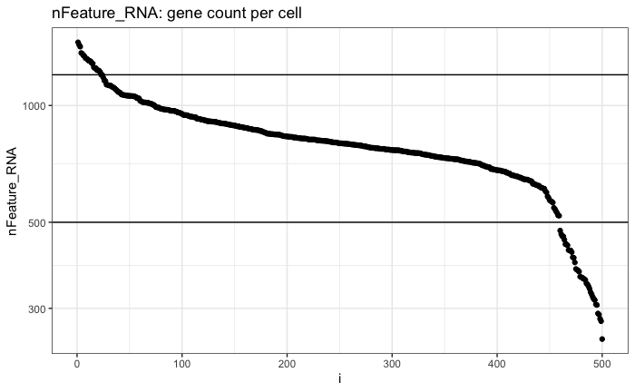

Vignette for Tertiary processing for SC-Kinnex
===============================================

Creating sparse matrices for use with Seurat
~~~~~~~~~~~~~~~~~~~~~~~~~~~~~~~~~~~~~~~~~~~~~~~~

Setting the environment:

.. code:: bash

    sudo apt install r-base
    sudo R -e 'install.packages("BiocManager", repos="http://cran.us.r-project.org")'
    sudo R -e 'BiocManager::install("argparse")'
    conda create -n scIsoseqUtil
    conda activate scIsoseqUtil
    conda install bioconda::r-argparse
    pip install pysam

.. code:: bash

    # from:
    # https://github.com/MethodsDev/scIsoquantMatrixBuilder

    wget https://github.com/MethodsDev/kinnex-documentation-external/archive/refs/heads/main.zip

    scIsoseqUtil.py --sample_id ${sample_id} \
                    --bam ${sample_id}.aligned.sorted.bam \
                    --transcript_model_reads ${sample_id}.transcript_model_reads.tsv.gz \
                    --transcript_models_gtf ${sample_id}.transcript_models.gtf.gz

Analysing sparse matrices created above
~~~~~~~~~~~~~~~~~~~~~~~~~~~~~~~~~~~~~~~~

The code below is an ``R`` code, blocks can be copied to ``Rmd`` to excute locally:

.. code:: bash

    # {r setup, include=FALSE}
        knitr::opts_chunk$set(echo = TRUE)
        library(tidyverse)
        library(Seurat)

Input counts matrix created above from step1
~~~~~~~~~~~~~~~~~~~~~~~~~~~~~~~~~~~~~~~~~~~~~

.. code:: bash

    #{r}
        data_dir = "scKinnex.genes-sc_matrix_from_isoquant/"
        output_prefix = "scKinnex.genes"

Reading data in using Read10x()
~~~~~~~~~~~~~~~~~~~~~~~~~~~~~~~~

.. code:: bash

    #{r}
        data = Read10X(data.dir=data_dir,
               gene.column = 1,
               cell.column = 2,
               unique.features = TRUE,
               strip.suffix = FALSE)

Creating seurat object from counts matrix
~~~~~~~~~~~~~~~~~~~~~~~~~~~~~~~~~~~~~~~~~~

.. code:: bash

    #{r}
    seurat_obj <- CreateSeuratObject(counts = data, project = "project", min.cells = 3, min.features = 200)
    seurat_obj

Terminal Out:
11390 features across 500 samples within 1 assay 
Active assay: RNA (11390 features, 0 variable features)
1 layer present: counts

.. code:: bash

    #{r}
    # before filtering
    seurat_obj@meta.data %>% summarize(median(nCount_RNA), median(nFeature_RNA))    

Terminal Out:
median(nCount_RNA)        median(nFeature_RNA)
<dbl>                     <dbl>
2794.17                   799

Filtering on UMI counts
~~~~~~~~~~~~~~~~~~~~~~~~

.. code:: bash

    #{r}
    UMI_count_high = 15000
    UMI_count_low = 1500

    
    seurat_obj@meta.data %>% select(nCount_RNA) %>% arrange(desc(nCount_RNA)) %>% mutate(i=row_number()) %>%
    ggplot(aes(x=i, y=nCount_RNA)) + geom_point() + theme_bw() + scale_y_continuous(trans='log10') +
    ggtitle("nCount_RNA: UMI counts per cell") + 

    geom_hline(yintercept=UMI_count_high) +
    geom_hline(yintercept=UMI_count_low) 

Filtering on feature counts
~~~~~~~~~~~~~~~~~~~~~~~~~~~~

.. code:: bash

    #{r}
    feature_count_high = 2000
    feature_count_low = 300

    
    seurat_obj@meta.data %>% select(nFeature_RNA) %>% arrange(desc(nFeature_RNA)) %>% mutate(i=row_number()) %>%
    ggplot(aes(x=i, y=nFeature_RNA)) + geom_point() + theme_bw() + scale_y_continuous(trans='log10') +
    ggtitle("nFeature_RNA: gene count per cell") + 

    geom_hline(yintercept=feature_count_high) +
    geom_hline(yintercept=feature_count_low)

.. code:: bash

    #{r}
    seurat_obj[["percent.mt"]] <- PercentageFeatureSet(seurat_obj, pattern = "^MT-")

.. code:: bash

    #{r}
    # Visualize QC metrics as a violin plot
    VlnPlot(seurat_obj, features = c("nFeature_RNA", "nCount_RNA", "percent.mt"), ncol = 3)

.. code:: bash

    #{r}
    plot1 <- FeatureScatter(seurat_obj, feature1 = "nCount_RNA", feature2 = "percent.mt")
    plot2 <- FeatureScatter(seurat_obj, feature1 = "nCount_RNA", feature2 = "nFeature_RNA")
    plot1 + plot2

NormalizeData : Normalize the count data present in a given assay.
Normalization methods =
“LogNormalize”: Feature counts for each cell are divided by the total counts for that cell and multiplied by the scale.factor. 
This is then natural-log transformed using log1p.

.. code:: bash

    #{r}
    seurat_obj <- NormalizeData(seurat_obj, normalization.method = "LogNormalize", scale.factor = 10000)

FindVariableFeatures: Identifies features that are outliers on a 'mean variability plot'.

selection.method =
“vst”: First, fits a line to the relationship of log(variance) and log(mean) using local polynomial regression (loess). 
Then standardizes the feature values using the observed mean and expected variance (given by the fitted line). 
Feature variance is then calculated on the standardized values after clipping to a maximum (see clip.max parameter).

.. code:: bash

    #{r}
    seurat_obj <- FindVariableFeatures(seurat_obj, selection.method = "vst", nfeatures = 2000)

    # Identify the 10 most highly variable genes
    top10 <- head(VariableFeatures(seurat_obj), 10)

    # plot variable features with and without labels
    plot1 <- VariableFeaturePlot(seurat_obj)
    plot2 <- LabelPoints(plot = plot1, points = top10, repel = TRUE)
    plot1 + plot2

Saving object.RDS
~~~~~~~~~~~~~~~~~
.. code:: bash

    #{r}
    # save before filtering

    saveRDS(seurat_obj, file = paste0(output_prefix, "-seurat_obj-preCellFiltering.rds"))

.. code:: bash

    length(seurat_obj$percent.mt < 15)
    feature_count_low
    feature_count_high
    UMI_count_low
    UMI_count_high

Terminal Out:
[1] 415
[1] 500
[1] 1200
[1] 1900
[1] 5000

.. code:: bash

    #{r}
    # filter cells

    #### examine the above plots to decide on filtering thresholds below

    seurat_obj <- subset(seurat_obj, 
                        subset = nFeature_RNA > feature_count_low & nFeature_RNA < feature_count_high &
                        nCount_RNA > UMI_count_low & nCount_RNA < UMI_count_high & 
                        percent.mt < 15)

    seurat_obj

Temrinal Output:

An object of class Seurat 
11390 features across 415 samples within 1 assay 
Active assay: RNA (11390 features, 2000 variable features)
1 layer present: counts

.. code:: bash

    #{r}
    # after filtering
    seurat_obj@meta.data %>% summarize(median(nCount_RNA), median(nFeature_RNA))

Temrinal Output:

median(nCount_RNA)      median(nFeature_RNA)
<dbl>                   <int>
2838.12	                811	

ScaleData: 
Scales and centers features in the dataset. 
If variables are provided in vars.to.regress, they are individually regressed against each feature, and the resulting residuals are then scaled and centered.

.. code:: bash

    #{r}
    all.features <- rownames(seurat_obj)
    seurat_obj <- ScaleData(seurat_obj, features = all.features)

Performing  PCA :
~~~~~~~~~~~~~~~~~

RunPCA: Run Principal Component Analysis on gene expression using IRLBA. For details about stored PCA calculation parameters, see `PrintPCAParams`.
VizDimLoadings: Visualize top genes associated with reduction components
DimPlot:
Graphs the output of a dimensional reduction technique (PCA by default). Cells are colored by their identity class.

.. code:: bash

    #{r}
    seurat_obj <- RunPCA(seurat_obj, features = VariableFeatures(object = seurat_obj))
    VizDimLoadings(seurat_obj, dims = 1:2, reduction = "pca")
    DimPlot(seurat_obj, reduction = "pca") + NoLegend()
    DimHeatmap(seurat_obj, dims = 1:3, cells = 500, balanced = TRUE)
    ElbowPlot(seurat_obj)

Generating UMAP : 
~~~~~~~~~~~~~~~~~

.. code:: bash

    #{r}
    seurat_obj <- FindNeighbors(seurat_obj, dims = 1:10)
    seurat_obj <- FindClusters(seurat_obj, resolution = 0.5)
    seurat_obj <- RunUMAP(seurat_obj, dims = 1:10)
    DimPlot(seurat_obj, reduction = "umap")

    FeaturePlot(seurat_obj, features = c("nFeature_RNA"))

    FeaturePlot(seurat_obj, features = c("nCount_RNA"))

    FeaturePlot(seurat_obj, features = c("percent.mt"))

Feature Count plots from terminal out part1 :

.. list-table:: 
    :widths: 50 50 

    * - .. figure:: ../_images/UMAP_DimPlot.png
           :alt: UMAP_DimPlot.png

           UMAP_DimPlot

      - .. figure:: ../_images/nFeature_RNA_FeaturePlot.png
           :alt: nFeature_RNA_FeaturePlot.png

           nFeature_RNA_FeaturePlot

Feature Count plots from terminal out part2:

.. list-table:: 
    :widths: 50 50

      - .. figure:: ../_images/nFeature_RNA_FeaturePlot.png
           :alt: nFeature_RNA_FeaturePlot

           nFeature_RNA_FeaturePlot

      - .. figure:: ../_images/percent_mt_FeaturePlot.png
           :alt: percent_mt_FeaturePlot

           percent_mt_FeaturePlot

.. code:: bash

    #{r}
    # counts and fractions of cells

    cluster_counts_n_fracs = seurat_obj@meta.data %>% group_by(seurat_clusters) %>% tally() %>%  mutate(frac=prop.table(n))

    cluster_counts_n_fracs

    saveRDS(seurat_obj, file = paste0(output_prefix, "-seurat_obj.rds"))

Terminal Out:

seurat_clusters n frac
<fctr> <int> <dbl>
0	219	0.52771084	
1	128	0.30843373		
2	45	0.10843373	
3	23	0.05542169	

DE, find markers:
~~~~~~~~~~~~~~~~~

find markers for every cluster compared to all remaining cells, report only the positive ones

.. code:: bash

    #{r}
    # find markers for every cluster compared to all remaining cells, report only the positive
    # ones
    seurat_obj.markers <- FindAllMarkers(seurat_obj, only.pos = TRUE)
    seurat_obj.markers %>%
        group_by(cluster) %>%
        dplyr::filter(avg_log2FC > 1)   

.. code:: bash

    #{r}
    top_20_markers = seurat_obj.markers %>%
    group_by(cluster) %>%
    dplyr::filter(avg_log2FC > 1) %>% slice_head(n=20) %>% ungroup()

    top_20_markers

.. code:: bash

    #{r}
    max_cluster <- max(as.numeric(top_20_markers$cluster)) - 1

    for (clnum in 0:max_cluster) {
        cluster = top_20_markers %>% filter(cluster == clnum)
  
  
            gene.symbols = sapply(cluster$gene, function(x) { str_split(x, "\\^")[[1]][1] })
  
            gene.symbols = grep("ENSG|ENST|novel", gene.symbols, value=T, invert=T)
  
        cat(paste0(clnum,":"))
        cat(gene.symbols, sep=",")
        cat("\n")
    }

.. code:: bash

    Terminal Out:

    0:IL7R,LTB,PRKCQ-AS1,RPL34,RCAN3,GAS5,TCF7,LEF1,MAL,CD27,CCR7,ANKRD44-AS1,RGCC,RGS10,NOSIP,TMEM123,CAMK4
    1:NKG7,GZMH,CST7,GZMA,GNLY,FGFBP2,CCL5,CCL4,PRF1,EFHD2,PLEK,HOPX,PFN1,GZMM,CALM1,GZMB,SH3BGRL3,CTSW,XCL2,TRGC2
    2:CD79A,IGHM,CD79B,BANK1,HLA-DQA1,BCL11A,HLA-DRA,TCL1A,TNFRSF13C,HLA-DMB,HLA-DRB1,SWAP70,VPREB3,RALGPS2
    3:CSTA,SERPINA1,CFD,VCAN,RGS2,MNDA,CD68,CYP27A1,RETN,CPVL,CLEC12A,LMO2,GRN,LST1,CYBB,NCF2,LILRA5,FCN1

Run above list through: http://xteam.xbio.top/ACT to get cell type predictions.

.. code:: bash

    #{r}
    # save files for later read/cell tracking

    write.table( Idents(seurat_obj), paste0(output_prefix, "-cell_cluster_assignments.tsv"), quote=F, row.names=T, sep="\t")

.. code:: bash

    #{r}
    saveRDS(seurat_obj, file = paste0(output_prefix, "-seurat_obj.rds"))

Examining specific gene sets example
Note, this helps to have the gene-symbol annotated gene features.

.. code:: bash

    #{r}
    # example definition of marker genes for certain cell types

    marker_genes = list()

    marker_genes[["ExN"]] = c("RORB", "SLC17A6", "SLC17A7", "THEMIS")

    marker_genes[["InN"]] = c("GAD1","GAD2","PVALB","SST","VIP")

    marker_genes[["MG"]] = c("APBB1IP","CD74","CSF1R", "CX3CR1", "ITGAM", "P2RY12", "PTPRC")

    marker_genes[["Astro"]] =c("ALDH1L1", "AQP4", "COL5A3", "GFAP", "SLC1A2", "SLC1A3")

    marker_genes[["Oligo"]] = c("CLDN11", "MBP", "MOBP", "OPALIN", "PLP1", "ST18")

    marker_genes[["OPC"]] = c("LHFPL3", "MEGF11", "PCDH15", "PDGFRA", "VCAN")

    marker_genes[["VC"]] = c("CLDN5", "COLEC12", "EPAS1", "VCAM1")

.. code:: bash

    #{r}

    # function to extract gene ids with the relevant gene symbols

    feature_names = rownames(seurat_obj@assays$RNA$counts)

    get_feature_names_with_gene_symbols = function(gene_symbols) {
  
    gene_ids = c()
  
    for (gene_symbol in gene_symbols) {
        found_genes = grep(paste0(gene_symbol,"\\^"), feature_names, value=T) 
     if (length(found_genes) > 0) {
            gene_ids = c(gene_ids, found_genes)
        }
    }
    return(gene_ids)
    }

.. code:: bash

    #{r}
    # paint umaps according to the features of interest

    feature_ids = get_feature_names_with_gene_symbols(marker_genes[["ExN"]])

    VlnPlot(seurat_obj, features = feature_ids)
    FeaturePlot( seurat_obj, features = feature_ids)