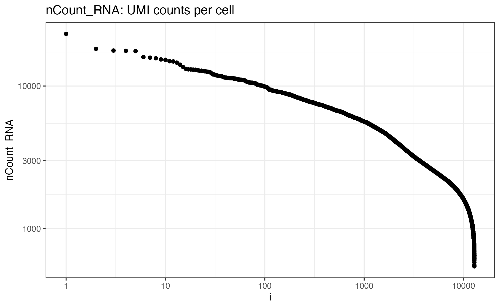
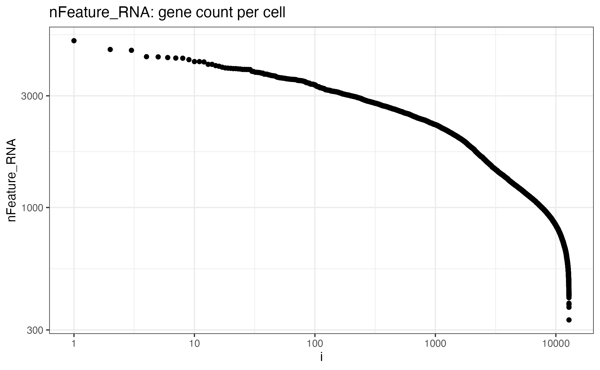
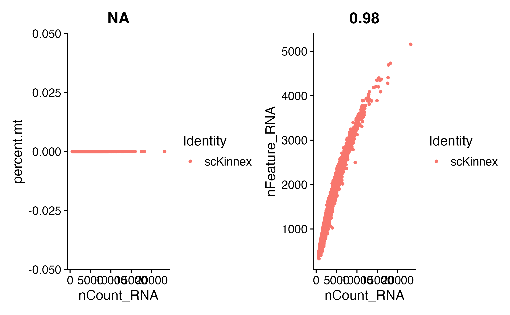
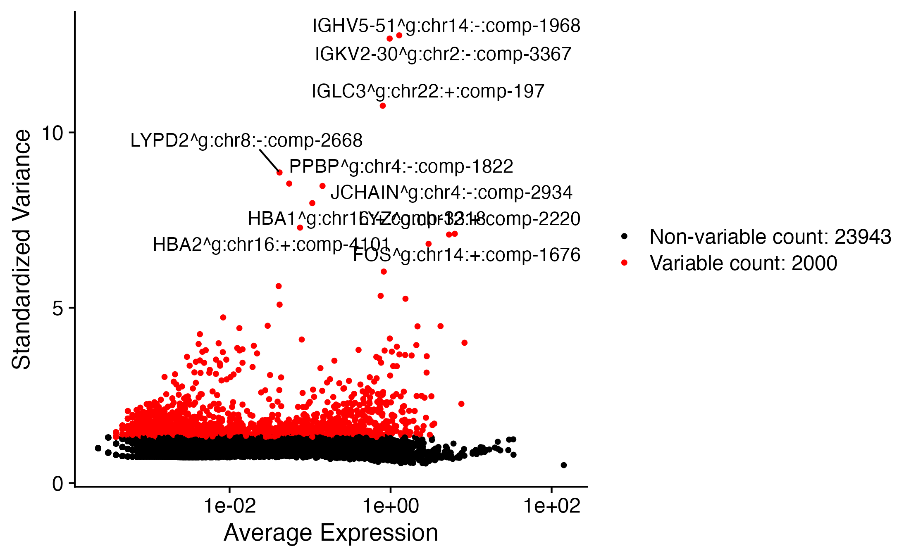

3.2 Vignette for Tertiary processing for SC-Kinnex
===================================================

This vigentte leverages various parts of the `Seurat package <https://satijalab.org/seurat/>`_ and follows along in parts the `"Seurat - Guided Clustering Tutorial" <https://satijalab.org/seurat/articles/pbmc3k_tutorial.html>`_
The standalone utility scIsoseqUtil.py, developed at MDL, creates sparce matrices from Isoquant Outs namely, transcript_model_reads and transcript_models_gtfs. 
The script is provided in source repo here. 

Creating sparse matrices for use with Seurat
~~~~~~~~~~~~~~~~~~~~~~~~~~~~~~~~~~~~~~~~~~~~~~~~

Setting the environment:

.. code:: bash

    sudo apt install r-base
    sudo R -e 'install.packages("BiocManager", repos="http://cran.us.r-project.org")'
    sudo R -e 'BiocManager::install("argparse")'
    conda create -n scIsoseqUtil
    conda activate scIsoseqUtil
    conda install bioconda::r-argparse
    pip install pysam

.. code:: bash

    # from:
    # https://github.com/MethodsDev/scIsoquantMatrixBuilder

    wget https://github.com/MethodsDev/kinnex-documentation-external/archive/refs/heads/main.zip

    scIsoseqUtil.py --sample_id ${sample_id} \
                    --bam ${sample_id}.aligned.sorted.bam \
                    --transcript_model_reads ${sample_id}.transcript_model_reads.tsv.gz \
                    --transcript_models_gtf ${sample_id}.transcript_models.gtf.gz

Analysing sparse matrices created above
~~~~~~~~~~~~~~~~~~~~~~~~~~~~~~~~~~~~~~~~

The code below is an ``R`` code, blocks can be copied to ``Rmd`` to excute locally:

.. code:: bash

    install_if_missing <- function(packages) {
    if (length(setdiff(packages, rownames(installed.packages()))) > 0) {
        install.packages(setdiff(packages, rownames(installed.packages())))
        }
    }

    install_if_missing(c('tidyverse','stringr','dplyr','edgeR','ggrepel','DESeq2','Seurat','clustermole'))

.. code:: bash

    # {r setup, include=FALSE}
        knitr::opts_chunk$set(echo = TRUE)
        library(tidyverse)
        library(Seurat)

Input counts matrix created above from step1
~~~~~~~~~~~~~~~~~~~~~~~~~~~~~~~~~~~~~~~~~~~~~

.. code:: bash

    #{r}
        data_dir = "scKinnex.genes-sc_matrix_from_isoquant/"
        output_prefix = "scKinnex.genes"

Reading data in using Read10x()
~~~~~~~~~~~~~~~~~~~~~~~~~~~~~~~~

.. code:: bash

    #{r}
        data = Read10X(data.dir=data_dir,
               gene.column = 1,
               cell.column = 2,
               unique.features = TRUE,
               strip.suffix = FALSE)

UMI counts per cell:
~~~~~~~~~~~~~~~~~~~~~

.. code:: bash

    #{r}
        umi_counts_per_cell = colSums(data)

sorting:
~~~~~~~~

.. code:: bash

    #{r}
        umi_counts_per_cell = sort(umi_counts_per_cell, decreasing = T)

plotting :
~~~~~~~~~~~

.. code:: bash

    #{r}
        plot(umi_counts_per_cell, log='xy')
        ggsave(filename='PBMC_complete_umi_counts_per_cell.png',path=data_dir, plot = last_plot())

Creating seurat object from counts matrix
~~~~~~~~~~~~~~~~~~~~~~~~~~~~~~~~~~~~~~~~~~

.. code:: bash

    #{r}
    seurat_obj <- CreateSeuratObject(counts = data, project = "project", min.cells = 3, min.features = 200)
    seurat_obj

Output:
An object of class Seurat 
25943 features across 12851 samples within 1 assay 
Active assay: RNA (25943 features, 0 variable features)
1 layer present: counts

.. code:: bash

    #{r}
    # before filtering
    seurat_obj@meta.data %>% summarize(median(nCount_RNA), median(nFeature_RNA))    

Terminal Out:

median(nCount_RNA)        median(nFeature_RNA)
<dbl>                     <dbl>
2250.01                    1087

PercentageFeatureSet - Calculate the percentage of all counts that belong to a given set of features

.. code:: bash

    #{r}
        seurat_obj[["percent.mt"]] <- PercentageFeatureSet(seurat_obj, pattern = "^MT-")

Exploring seurat object:

.. code:: bash

    #{r}
        seurat_obj
        seurat_obj@meta.data %>% head()

UMI counts per cell
~~~~~~~~~~~~~~~~~~~~~~~~

.. code:: bash

    #{r}
    seurat_obj@meta.data %>% dplyr::select(nCount_RNA) %>% 
    arrange(desc(nCount_RNA)) %>% 
    dplyr::mutate(i=row_number()) %>%
    ggplot(aes(x=i, y=nCount_RNA)) + geom_point() + theme_bw() + 
    scale_y_continuous(trans='log10') +
    scale_x_continuous(trans='log10') +
    ggtitle("nCount_RNA: UMI counts per cell")

Feature counts per cell:
~~~~~~~~~~~~~~~~~~~~~~~~~~~~

.. code:: bash

    #{r}
        seurat_obj@meta.data %>% dplyr::select(nFeature_RNA) %>% arrange(desc(nFeature_RNA)) %>% dplyr::mutate(i=row_number()) %>%
        ggplot(aes(x=i, y=nFeature_RNA)) + geom_point() + theme_bw() + 
        scale_y_continuous(trans='log10') +
        scale_x_continuous(trans='log10') +
        ggtitle("nFeature_RNA: gene count per cell") 

Visualize QC metrics as a violin plot

VlnPlot: Draws a violin plot of single cell data (gene expression, metrics, PC scores, etc.)

.. code:: bash

    #{r}
    # Visualize QC metrics as a violin plot
    VlnPlot(seurat_obj, features = c("nFeature_RNA", "nCount_RNA", "percent.mt"), ncol = 3)

.. code:: bash

    #{r}
    plot1 <- FeatureScatter(seurat_obj, feature1 = "nCount_RNA", feature2 = "percent.mt")
    plot2 <- FeatureScatter(seurat_obj, feature1 = "nCount_RNA", feature2 = "nFeature_RNA")
    plot1 + plot2

Saving object.RDS

.. code:: bash

    #{r}
    #saveRDS(seurat_obj, file = paste0(data_dir, output_prefix, "-seurat_obj-preCellFiltering.rds"))

filtering cells on percent Mitochondria:

.. code:: bash

    #{r}
    #### filtering cells on 
    length(seurat_obj$percent.mt < 15)
    seurat_obj <- subset(seurat_obj, 
                     percent.mt < 15)
    seurat_obj

Terminal Out:
An object of class Seurat 
25943 features across 12851 samples within 1 assay 
Active assay: RNA (25943 features, 0 variable features)
1 layer present: counts

Summarize:

.. code:: bash

    #{r}
        seurat_obj@meta.data %>% summarize(median(nCount_RNA), median(nFeature_RNA))

Terminal Output:
median(nCount_RNA)      median(nFeature_RNA)
<dbl>                   <int>
2250.01	                1087

NormalizeData : Normalize the count data present in a given assay.
Normalization methods =
“LogNormalize”: Feature counts for each cell are divided by the total counts for that cell and multiplied by the scale.factor. 
This is then natural-log transformed using log1p.

.. code:: bash

    #{r}
    seurat_obj <- NormalizeData(seurat_obj, normalization.method = "LogNormalize", scale.factor = 10000)

FindVariableFeatures: Identifies features that are outliers on a 'mean variability plot'.

selection.method =
“vst”: First, fits a line to the relationship of log(variance) and log(mean) using local polynomial regression (loess). 
Then standardizes the feature values using the observed mean and expected variance (given by the fitted line). 
Feature variance is then calculated on the standardized values after clipping to a maximum (see clip.max parameter).

.. code:: bash

    #{r}
    seurat_obj <- FindVariableFeatures(seurat_obj, selection.method = "vst", nfeatures = 2000)

    # Identify the 10 most highly variable genes
    top10 <- head(VariableFeatures(seurat_obj), 10)

    # plot variable features with and without labels
    plot1 <- VariableFeaturePlot(seurat_obj)
    plot2 <- LabelPoints(plot = plot1, points = top10, repel = TRUE)
    plot1 + plot2
    

ScaleData: 
Scales and centers features in the dataset. 
If variables are provided in vars.to.regress, they are individually regressed against each feature, and the resulting residuals are then scaled and centered.

.. code:: bash

    #{r}
    all.features <- rownames(seurat_obj)
    seurat_obj <- ScaleData(seurat_obj, features = all.features)

Performing  PCA :
~~~~~~~~~~~~~~~~~

RunPCA: Run Principal Component Analysis on gene expression using IRLBA. For details about stored PCA calculation parameters, see `PrintPCAParams`.

.. code:: bash

    #{r}
    seurat_obj <- RunPCA(seurat_obj, features = VariableFeatures(object = seurat_obj))

VizDimLoadings: Visualize top genes associated with reduction components

.. code:: bash

    #{r}

    VizDimLoadings(seurat_obj, dims = 1:2, reduction = "pca")

DimPlot:
Graphs the output of a dimensional reduction technique (PCA by default). Cells are colored by their identity class.

.. code:: bash

    #{r}

    DimPlot(seurat_obj, reduction = "pca") + NoLegend()
    DimHeatmap(seurat_obj, dims = 1:3, cells = 500, balanced = TRUE)
    ElbowPlot(seurat_obj)

.. figure:: ../_images/PBMC_complete_ElbowPlot.png
   :height: 500px
   :width: 1000px
   :align: center

Generating UMAP : 
~~~~~~~~~~~~~~~~~

.. code:: bash

    #{r}
    seurat_obj <- FindNeighbors(seurat_obj, dims = 1:8)
    seurat_obj <- FindClusters(seurat_obj, resolution = 0.8)
    seurat_obj <- RunUMAP(seurat_obj, dims = 1:8)
    DimPlot(seurat_obj, reduction = "umap")

    FeaturePlot(seurat_obj, features = c("nFeature_RNA"))

    FeaturePlot(seurat_obj, features = c("nCount_RNA"))

    FeaturePlot(seurat_obj, features = c("percent.mt"))

Feature Count plots from terminal out:

.. list-table:: 
    :widths: 50 50 

    * - .. figure:: ../_images/PBMC_complete_UMAP_DimPlot.png
           :alt: PBMC_complete_UMAP_DimPlot.png

           UMAP_DimPlot

      - .. figure:: ../_images/PBMC_complete_nFeature_RNA_FeaturePlot.png
           :alt: PBMC_complete_nFeature_RNA_FeaturePlot.png

           nFeature_RNA_FeaturePlot

Feature Count plots from terminal out:

.. list-table:: 
    :widths: 50 50

    * - .. figure:: ../_images/PBMC_complete_nCount_RNA_FeaturePlot.png
           :alt: nFeature_RNA_FeaturePlot

           nFeature_RNA_FeaturePlot

      - .. figure:: ../_images/PBMC_complete_percent_mt_FeaturePlot.png
           :alt: percent_mt_FeaturePlot

           percent_mt_FeaturePlot

.. code:: bash

    #{r}
    # counts and fractions of cells

    cluster_counts_n_fracs = seurat_obj@meta.data %>% group_by(seurat_clusters) %>% tally() %>%  mutate(frac=prop.table(n))

    cluster_counts_n_fracs

    saveRDS(seurat_obj, file = paste0(output_prefix, "-seurat_obj.rds"))

Terminal Out:

seurat_clusters n frac
<fctr> <int> <dbl>
0	2243	0.174538946
1	1765	0.137343397	
2	1693	0.131740721	
3	1476	0.114854875	
4	1358	0.105672710	
5	1112	0.086530231	
6	1040	0.080927554	
7	979	0.076180842	
8	523	0.040697222	
9	262	0.020387518	
10	218	0.016963660		
11	102	0.007937126		
12	54	0.004202008
13	26	0.002023189	

DE, find markers:
~~~~~~~~~~~~~~~~~

find markers for every cluster compared to all remaining cells, report only the positive ones

.. code:: bash

    #{r}
    # find markers for every cluster compared to all remaining cells, report only the positive
    # ones
    seurat_obj.markers <- FindAllMarkers(seurat_obj, only.pos = TRUE)
    seurat_obj.markers %>%
        group_by(cluster) %>%
        dplyr::filter(avg_log2FC > 1)   

.. code:: bash

    #{r}
    top_20_markers = seurat_obj.markers %>%
    group_by(cluster) %>%
    dplyr::filter(avg_log2FC > 1) %>% slice_head(n=20) %>% ungroup()

    top_20_markers

.. code:: bash

    #{r}
    max_cluster <- max(as.numeric(top_20_markers$cluster)) - 1

    for (clnum in 0:max_cluster) {
        cluster = top_20_markers %>% filter(cluster == clnum)
  
  
            gene.symbols = sapply(cluster$gene, function(x) { str_split(x, "\\^")[[1]][1] })
  
            gene.symbols = grep("ENSG|ENST|novel", gene.symbols, value=T, invert=T)
  
        cat(paste0(clnum,":"))
        cat(gene.symbols, sep=",")
        cat("\n")
    }

.. code:: bash

    Terminal Out:

    0:LTB,IL7R,RNU1-125P,NOSIP,TNFRSF4,LDHB,AQP3,RGCC,KLRB1,IL7R,GZMK,CD40LG,GPR171,TRADD,CCR4,NPDC1,MAL,IFNG-AS1,CD69
    1:NKG7,GZMA,CCL5,LINC00987,A2M,GZMK,RNU1-125P,RNU6-1257P,SAMD3,PZP,TGFBR3,DUSP2,PYHIN1,GZMM,CCL4,KLRD1,GZMH,LINC01871,TRGV3,KLRC1
    2:LEF1,CCR7,LINC02446,LRRN3,RPS16,RPS6,MIR7111,RPS3A,RPL19,RPL35A,ARL6IP1,RPL32,RPS28,SNORD38B,RPL34,TPT1,RPS23,RPL13,RPS12,RPS14
    3:INPP4B,CDC14A,KLF12,LINC-PINT,ARHGAP15,PAG1,SKAP1,TC2N,CABYR,SERINC5,HIVEP2,STARD4-AS1,ANK3,BCL11B,CDC42SE2,BCL2,CYTH1,HELZ-AS1
    4:NKG7,GNLY,GZMA,CCL5,KLRC1,RNU6-1257P,GZMH,KLRD1,TGFBR3,FGFBP2,GZMB,TRGV3,SAMD3,PYHIN1,CCL4,TRDC,GZMM,KLRF1,CX3CR1,HOPX
    5:S100A8,MNDA,VCAN,CST3,FCN1,CD36,PLXDC2,TYROBP,RGS2,MS4A6A,CYBB,FOS,FGL2,CD14,LST1,CEBPD,AIF1,LYZ,ODF3B
    6:BANK1,IGHV5-51,RALGPS2,AFF3,FCRL1,MS4A1,MEF2C,HLA-DRA,HLA-DPA1,HLA-DQA1,MARCHF1,CD79B,HLA-DMA,CD79A,HLA-DPB1,LYN,STX7,CD74,IGKV2-30,AFF3
    7:LEF1,HELZ-AS1,BACH2,FHIT,MAML2,EIF4E3,CYP2R1,STARD4-AS1,TXK,SERINC5,MLLT3,MBNL1,BCL11B,C6orf132,FHIT,PDE7A,IL6ST,ARHGAP15,SATB1
    8:MNDA,CST3,FCN1,PLXDC2,FGL2,CD36,LST1,MS4A6A,TYROBP,SPI1,PSAP,IGSF6,VCAN,CYBB,AIF1,HLA-DRA,CPPED1,GPX1
    9:PLXDC2,RBM47,VCAN,ZEB2,SLC8A1,LRMDA,LYN,TBXAS1,AOAH,CPPED1,ARHGAP26,DMXL2,GRK3,CD36,MARCHF1,ATG7,NAMPT,DPYD
    10:FCGR3A,MS4A14,PELATON,SERPINA1,IFITM3,CSF1R,LILRB2,LRRC25,CLN6,LINC02432,MYOF,CD300H,CTSL,NDUFB9,MS4A4A,HMOX1,LYPD2,CKB,CDKN1C,TCF7L2
    11:FCER1A,CD1C,ENHO,CLEC10A,ATP1B1,CLIC2,FLT3,MIR511,PLD4,TIFAB,ZNF366,HLA-DPB2,IL18,CD1E,FCGR2B,TNFSF15
    12:MZB1,CLEC4C,DERL3,PTPRS,SCT,PTCRA,PTPRS,LRRC26,SLC35F3,CUX2,PPP1R14B-AS1,SLC12A3,GLDC,SCAMP5,PHEX
    13:GPRIN1,FCRL1,ADAM28,BANK1,LINC00926,g:chr1:-:comp-25443,OSBPL10,MS4A1,CD79A,MTARC2,CPNE5,FAM30A,LINC02397,FCGR1A,NMNAT1,PLEKHG1,CD40,COBLL1

using clustermole to add annotations:

.. code:: bash

    #{r}
    library(clustermole)
    clustermole_results = NULL

    for (clnum in 0:max_cluster) {
        cluster = top_20_markers %>% filter(cluster == clnum)

        gene.symbols = sapply(cluster$gene, function(x) { str_split(x, "\\^")[[1]][1] })

        gene.symbols = grep("ENSG|ENST|novel", gene.symbols, value=T, invert=T)

    tryCatch(
        expr = {

        cat(paste0(clnum,":"))
        cat(gene.symbols, sep=",")
        cat("\n")

        my_overlaps <- clustermole_overlaps(genes = gene.symbols, species = "hs")

        clustermole_results = bind_rows(
            clustermole_results,
                                  my_overlaps %>% mutate(clnum = clnum))
        },
        error = function(e){
        message("Error: ", e)
        },
        warning = function(w){
        message("Warning: ", w)
        }
    )
    }

    clustermole_summary = clustermole_results  %>% filter(db == "PanglaoDB") %>%
    group_by(clnum) %>% arrange(p_value) %>% filter(row_number() == 1) %>% arrange(clnum) %>%
    ungroup() %>%
    dplyr::select(clnum, organ, celltype, fdr)
    
    clustermole_summary

clnum organ celltype fdr
<int> <chr> <chr> <dbl>
0	Immune system	T cells	1.338613e-03	
1	Immune system	NK cells	7.001437e-17	
2	Immune system	T memory cells	2.180756e-02	
3	Immune system	T memory cells	7.487984e-04	
4	Immune system	NK cells	1.397130e-25	
5	Immune system	Macrophages	1.327224e-08	
6	Immune system	B cells	4.417823e-09	
7	Immune system	T memory cells	1.208889e-02	
8	Immune system	Macrophages	8.000349e-09	
9	Blood	Reticulocytes	2.323308e-01	
10	Immune system	Dendritic cells	2.491410e-01	
11	Immune system	Dendritic cells	1.833132e-02	
12	Immune system	Plasmacytoid dendritic cells	8.752285e-06	
13	Immune system	B cells naive	1.240425e-06	

.. code:: bash

    #{r}
    # save files for later read/cell tracking

    write.table( Idents(seurat_obj), paste0(output_prefix, "-cell_cluster_assignments.tsv"), quote=F, row.names=T, sep="\t")

.. code:: bash

    #{r}
    saveRDS(seurat_obj, file = paste0(output_prefix, "-seurat_obj.rds"))

Installing clustermole:
https://cran.rstudio.com/web/packages/clustermole/vignettes/clustermole-intro.html

.. code:: bash

    #{r}
    #BiocManager::install("igordot/clustermole", update = FALSE)

Examining specific gene sets example
Note, this helps to have the gene-symbol annotated gene features.

.. code:: bash

    #{r}
    # example definition of marker genes for certain cell types

    marker_genes = list()

    marker_genes[["Tcells"]] = c("CD8A","CD8B","CD3","CD4","CD127","PRF1", "GZMB", "CD28","LTB")

.. code:: bash

    #{r}

    # function to extract gene ids with the relevant gene symbols

    feature_names = rownames(seurat_obj@assays$RNA$counts)

    get_feature_names_with_gene_symbols = function(gene_symbols) {
  
    gene_ids = c()
  
    for (gene_symbol in gene_symbols) {
        found_genes = grep(paste0(gene_symbol,"\\^"), feature_names, value=T) 
     if (length(found_genes) > 0) {
            gene_ids = c(gene_ids, found_genes)
        }
    }
    return(gene_ids)
    }

.. code:: bash

    #{r}
    # paint umaps according to the features of interest
    feature_ids = get_feature_names_with_gene_symbols(marker_genes[["Tcells"]])
    
    VlnPlot(seurat_obj, features = feature_ids, combine=FALSE)

.. list-table:: 
    :widths: 33 33 33

    * - .. figure:: ../_images/PBMC_complete_CD8A.png
           :alt: CD8A

           CD8A 

      - .. figure:: ../_images/PBMC_complete_CD8B.png
           :alt: CD8B

           CD8B

      - .. figure:: ../_images/PBMC_complete_CD28.png
           :alt: CD4

           CD4

.. list-table:: 
    :widths: 50 50

    * - .. figure:: ../_images/PBMC_complete_CD4.png
           :alt: CD88

           CD88

      - .. figure:: ../_images/PBMC_complete_GZMB.png
           :alt: GZMB

           GZMB

.. code:: bash

    #{r}

    FeaturePlot( seurat_obj, features = feature_ids)

.. list-table:: 
    :widths: 33 33 33

    * - .. figure:: ../_images/PBMC_complete_FeaturePlot_CD8A.png
           :alt: CD8A

           CD8A 

      - .. figure:: ../_images/PBMC_complete_FeaturePlot_CD8B.png
           :alt: CD8B

           CD8B

      - .. figure:: ../_images/PBMC_complete_FeaturePlot_CD28.png
           :alt: CD28

           CD28

.. list-table:: 
    :widths: 50 50

    * - .. figure:: ../_images/PBMC_complete_FeaturePlot_PRF1.png
           :alt: PRF1

           PRF1

      - .. figure:: ../_images/PBMC_complete_FeaturePlot_GZMB.png
           :alt: GZMB

           GZMB

