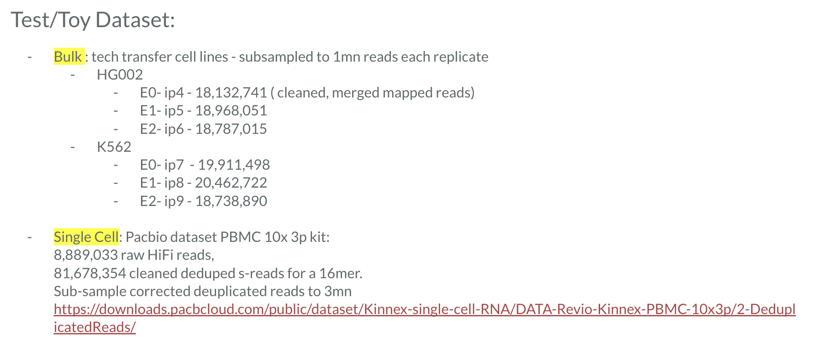
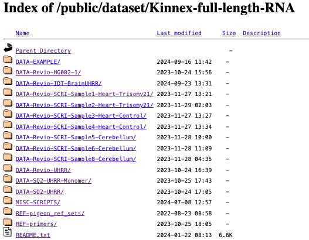

To-do Tasks/ Feedback
=====================
|:bulb:| - discussion

|:green_circle:| - completed

|:salad:| - done but review before publishing

|:o:| - open/currently working

|:stop_sign:| - blocked

Sep4th:
-------
1. Can we add/Should add toctree in Index left side panel? Yes we can we'd like. |:salad:|
2. Use seperate test datasets for each of the 3 sub-workflows pre, sec and tert. |:salad:|
3. Add info on bulk multiplexing - preferrably schametic |:salad:|

Sep 25th:
---------
4. Use PacBio dataset for single cell analysis, from cleaned s-reads but push it through the R-vignette we have |:o:|
5. for bulk use cell lines from tech transfer  - start from Isoquant counts - ref guided |:o:|
6. Ok to use google collab - find out approx. mem usage and $ required to run our vigenettes - using personal collab account |:bulb:| 
7. updated version of MDL genomeview - add static page |:stop_sign:|
8. Add RNA seq QC+ page |:salad:|

Oct 24th:
---------
9. remove secondary processing or add minimap2 there and a toctree for ipynbs |:bulb:| 
10. Wet-lab best practices - revise and complete the page |:stop_sign:| 
11. Clearly mark vigenttes vs wdls |:salad:|
12. swap out MDL genomeview to ITV in workflows and other |:salad:|
13. can we have overarching workflow for all secondary analysis steps? merge- minimap2 - LongRNAseqQC? |:bulb:|

Oct25th:
--------

Other possibilities for Full Length:
FLNC - Full Length Non-concatemer reads - post-refine available for below datasets

