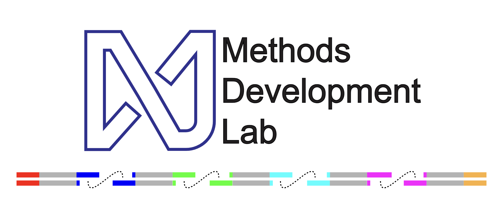

.. kinnex-docs-external documentation master file, created by
   sphinx-quickstart on Fri Sep  6 01:29:45 2024.
   You can adapt this file completely to your liking, but it should at least
   contain the root `toctree` directive.

Resource for long-read RNA isoform sequencing analysis
+++++++++++++++++++++++++++++++++++++++++++++++++++++++++++++

This website serves as an updated resource for bulk and single-cell RNA isoform sequencing analysis from Kinnex data. 
Using latest methods and best practices, we have compiled a series of workflows and notebook vignettes to facilitate data processing and analysis. 
We hope this resource will serve as a useful guide for this new and feature rich data type.

The Kinnex protocol is based on the MAS-ISO-seq method, developed at the Broad. For information on the approach, please reference the original publication in Nature Biotechnology:
   `High-throughput RNA isoform sequencing using programmed cDNA concatenation <https://doi.org/10.1038/s41587-023-01815-7>`_

From receiving sequencing data from `PacBio's Revio <https://www.pacb.com/revio/>`_ sequencing platform, 
the document steps through various pre-processing workflows for obtaining cleaned s-reads suitable for downstream processing and tertiary analysis workflows and vignettes developed by the `MDL team <https://methodsdevlab.org/>`_ at `Broad Clinical Labs <https://broadclinicallabs.org/>`_ 
to explore Kinnex datatypes.

`Repository of Public Datasets for Kinnex, Sequel2e and previous MAS-ISO-seq versions <https://downloads.pacbcloud.com/public/dataset/>`_

.. grid:: 2 

    .. grid-item-card::  Kinnex Full Length 
      :link: _subpages/bulk_landing_page
      :link-type: doc

      ``Overview and workflow`` 

    .. grid-item-card::  Kinnex Single Cell
      :link: _subpages/sc_landing_page
      :link-type: doc

      ``Overview and workflow``

.. toctree::
   :maxdepth: 2
   :caption: Index : 

   _subpages/pb_guidelines

.. toctree::
   :maxdepth: 4
   :caption: Kinnex Full Length :

   _subpages/bulk_landing_page
   _subpages/preprocessing_bulk
   _subpages/bulk_secondary_processing
   _subpages/readQC
   jupyter-notebooks/demo-ITV
   _subpages/bulk_tertiary_processing
   jupyter-notebooks/id_mapping_from_gffcompare
   _subpages/isoformSwitch_bulk

.. toctree::
   :maxdepth: 4
   :caption: Kinnex Single Cell :

   _subpages/sc_landing_page
   _subpages/preprocessing_sc
   _subpages/secondary_processing
   _subpages/readQC
   jupyter-notebooks/demo-ITV
   _subpages/LRAA_for_sc.rst
   _subpages/single_cell_tertiary_processing
   _subpages/sc_subsampling.rst

.. toctree::
   :maxdepth: 1
   :caption: Citations :

   _subpages/citations.rst
   _subpages/todo.rst

Indices and tables
==================

* :ref:`genindex`
* :ref:`search`

