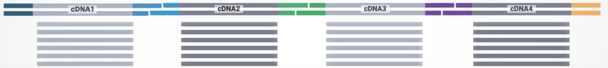

.. kinnex-docs-external documentation master file, created by
   sphinx-quickstart on Fri Sep  6 01:29:45 2024.
   You can adapt this file completely to your liking, but it should at least
   contain the root `toctree` directive.

MDL documentation and resources for supporting Pacbio Kinnex
+++++++++++++++++++++++++++++++++++++++++++++++++++++++++++++

The purpose of this documentation is to walk-through the various available computational methods and resources available for Kinnex products, 
to establish standard best-practices to explore the resulting datatypes and 
to introduce updated guides for analysing various Kinnex prodcuts.

From receiving sequencing data from `PacBio's Revio <https://www.pacb.com/revio/>`_ sequencing platform, 
the document steps through various pre-processing workflows for obtaining cleaned s-reads suitable for downstream processing and 
various tertiary analysis workflows and vigenttes developed by the `MDL team <https://methodsdevlab.org/>`_ at `Broad Clinical Labs <https://broadclinicallabs.org/>`_ 
to explore Kinnex datatypes.

.. grid:: 2 

    .. grid-item-card::  Kinnex Full Length 
      :link: _subpages/preprocessing_bulk 
      :link-type: doc

      ``Pre-processing workflows`` to extract clean s-reads

    .. grid-item-card::  Kinnex Single Cell
      :link: _subpages/preprocessing_bulk
      :link-type: doc

      Single-cell ``preliminary processing`` workflows

.. toctree::
   :maxdepth: 2
   :caption: Index:

   _subpages/pb_guidelines
   _subpages/preprocessing_bulk
   _subpages/readQC
   _subpages/secondary_tertiary_processing.rst

Doc set-up Notes:
=================

1. Link to best practices for Kinnex

   a. Guidelines - PacBio SMRT link v13 guide for Kinnex product documentation - Troubleshooting guide - Wetlab perspective

2. Processing the reads - Divide by Product type

   a. PacBio documentation 
   b. Our workflows with Dockstore links
   c. Cleaned S-reads → downstream bioinformatic analyses 

3. Read-level Quality Controls : 
   
   a. Read level SQANTI with RNAQC+

4. Analysis Vignettes for Kinnex Full Length product type: 

   a. Aligning to the genome - minimap2
   b. Isoform ID with IsoQuant 
   c. isoformQC
   d. Isoform Quantification
   e. Isoform Annotation - gffcompare, mdl- functional annotations attr vignette
   f. Visualization - IGV, Genomeview
   g. Differential Expression DEseq2
   h. isoformSwitchAnlysisR

5. Analysis Vignettes for Kinnex Single Cell Isoform analysis

Indices and tables
==================

* :ref:`genindex`
* :ref:`search`

Foot Note:
~~~~~~~~~~
This is a dev-test version of rtd-website to house MDL documentation. First we are trying to create the scanpy theme.
The theme for scanpy is sphinx-book-theme, with patches for readthedocs-sphinx-search

Next, we'll create the layout for the documentation and all the subsequent .rst pages. 
Once done with the the landing index page and we'll add/edit the relevant information to corresponding pages.

